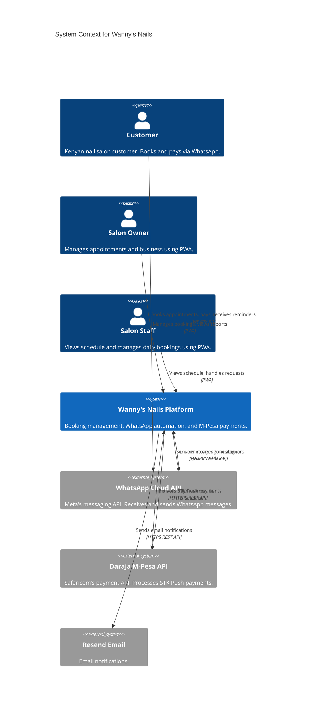
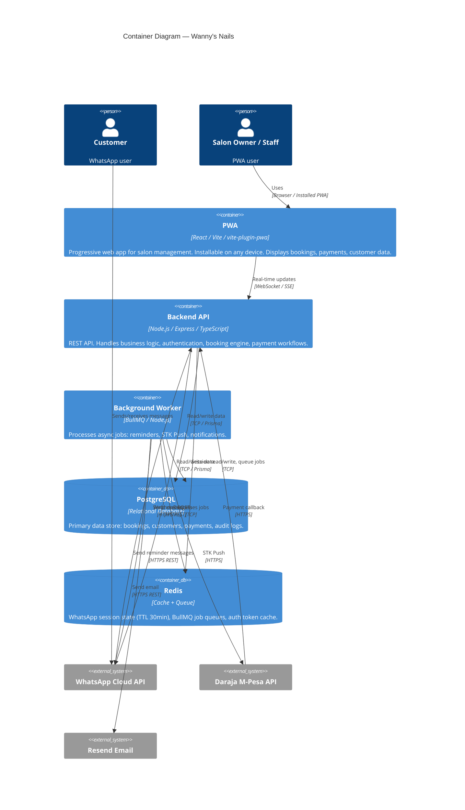
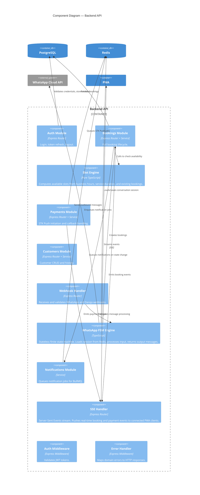
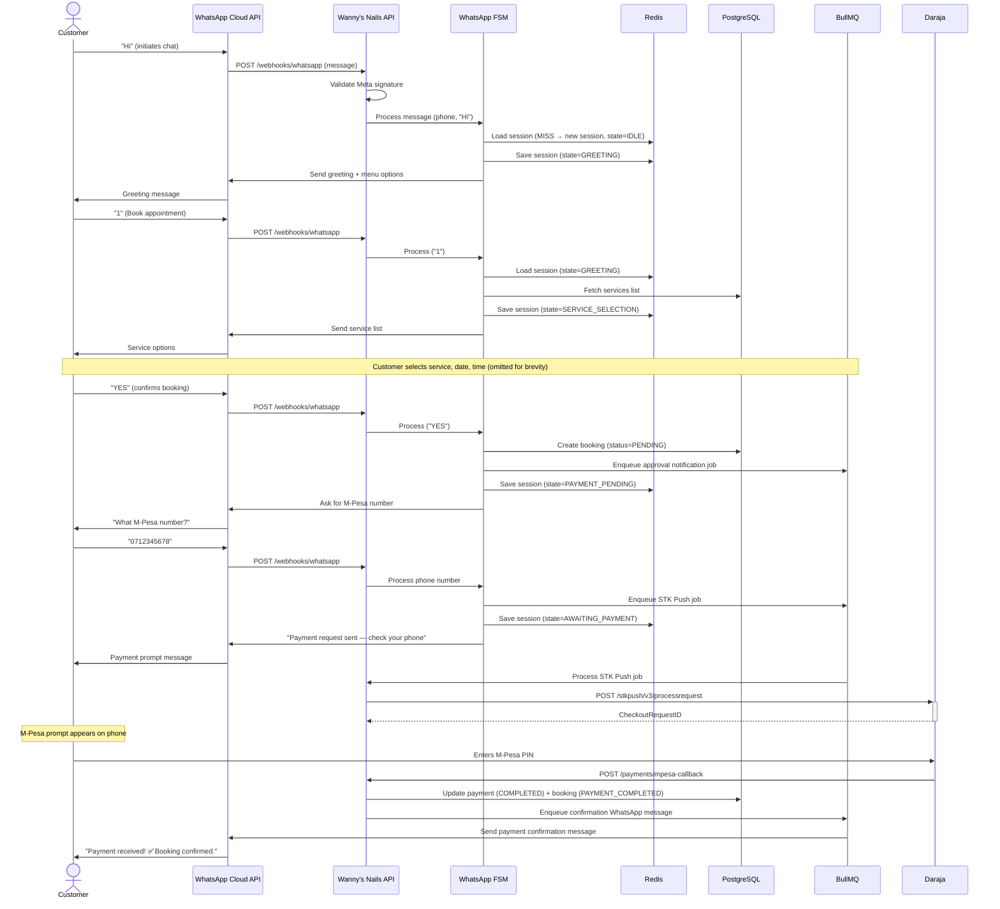
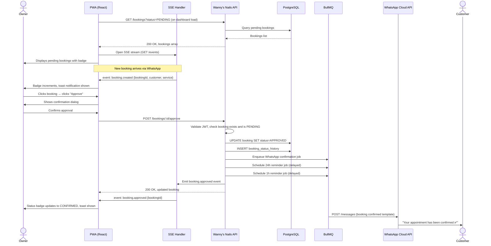
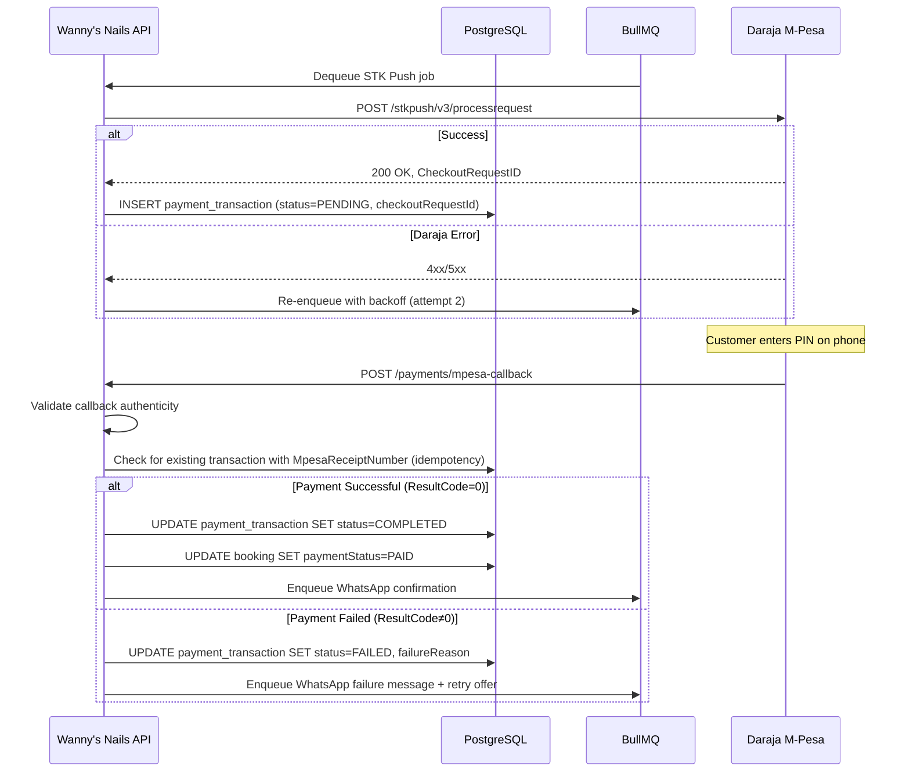
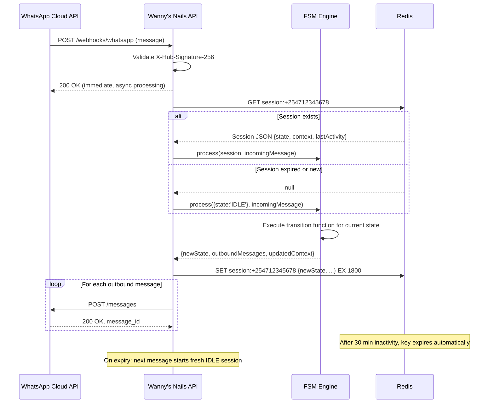

# Architecture — Wanny's Nails

**Version:** 1.1

---

## C4 Level 1: System Context Diagram

---

## C4 Level 2: Container Diagram

---

## C4 Level 3: Component Diagram — Backend API

---

## Sequence Diagram: Booking Creation (WhatsApp)

---

## Sequence Diagram: Booking Approval (PWA)

---

## Sequence Diagram: Payment Processing (STK Push)

---

## Sequence Diagram: WhatsApp Conversation Session Management

