# Booking Workflow — NailBook

**Version:** 1.0

---

## Booking Lifecycle

### State Diagram

```mermaid
stateDiagram-v2
    [*] --> PENDING : Customer completes WhatsApp flow\nor staff creates manually

    PENDING --> APPROVED : Owner/staff approves
    PENDING --> CANCELLED : Owner/staff cancels\nor customer cancels via WhatsApp

    APPROVED --> RESCHEDULED : Owner/staff reschedules
    APPROVED --> CANCELLED : Owner/staff cancels\nor customer cancels via WhatsApp
    APPROVED --> COMPLETED : Marked complete after appointment time
    APPROVED --> NO_SHOW : Customer does not arrive

    RESCHEDULED --> APPROVED : Reschedule creates a new appointmentAt;\nstatus returns to APPROVED
    
    COMPLETED --> [*]
    CANCELLED --> [*]
    NO_SHOW --> [*]
```



### State Descriptions

| State | Description | Who can enter this state |
|---|---|---|
| `PENDING` | Booking created, awaiting owner approval | System (WhatsApp flow), Staff (manual create) |
| `APPROVED` | Booking confirmed by owner/staff. Reminders scheduled. | Owner, Staff |
| `RESCHEDULED` | Booking moved to a new time (status transitions back to APPROVED) | Owner, Staff, Customer (via WhatsApp) |
| `COMPLETED` | Appointment has occurred. Set automatically by a scheduled job. | System (job), Owner |
| `CANCELLED` | Booking cancelled. Slot released. | Owner, Staff, Customer (via WhatsApp) |
| `NO_SHOW` | Customer did not appear. Set manually by staff. | Owner, Staff |

### Valid Transitions

| From | To | Actor | Trigger |
|---|---|---|---|
| PENDING | APPROVED | User | POST /bookings/:id/approve |
| PENDING | CANCELLED | User | POST /bookings/:id/cancel |
| APPROVED | RESCHEDULED → APPROVED | User | POST /bookings/:id/reschedule |
| APPROVED | CANCELLED | User/Customer | POST /bookings/:id/cancel |
| APPROVED | COMPLETED | System | Scheduled job after appointmentAt + durationMinutes |
| APPROVED | NO_SHOW | User | POST /bookings/:id/no-show |
| — | — | — | No transitions from COMPLETED, CANCELLED, or NO_SHOW |

---

## Payment Status Alongside Booking Status

Payment status is tracked separately on the `Booking` entity (and the related `Payment` record).

```
UNPAID        → initial state
PAYMENT_PENDING → STK Push sent, awaiting customer
PAID          → M-Pesa callback confirmed (ResultCode 0)
PAYMENT_FAILED → M-Pesa callback failed (ResultCode ≠ 0) or timed out
REFUNDED      → manual refund issued by owner
```

A booking can be APPROVED with UNPAID payment status — the owner controls this. The WhatsApp flow requests payment immediately, but in-person cash is also allowed (owner marks as PAID manually).

---

## Booking Reference Generation

References follow the format `WN-YYYY-WWWWW` where:
- `WN` — fixed prefix
- `YYYY` — year of creation
- `WWWWW` — zero-padded sequential number within the year

```typescript
async function generateBookingReference(year: number): Promise<string> {
  // Atomic increment via PostgreSQL sequence
  const result = await prisma.$queryRaw<[{ nextval: bigint }]>`
    SELECT nextval('booking_reference_seq_' || ${year}::text)
  `;
  const seq = Number(result[0].nextval);
  return `WN-${year}-${String(seq).padStart(5, '0')}`;
}
```

A separate sequence is created per year. Year sequences are created lazily on first use.

---

## Slot Generation Algorithm

```
Business Hours
      ↓
Working Days
      ↓
Existing Bookings
      ↓
Blocked Time
      ↓
Buffer Time
      ↓
Minimum Notice
      ↓
Service Duration
      ↓
Available Slots
```

### Business Hours Configuration

```typescript
interface BusinessHours {
  dayOfWeek: 0 | 1 | 2 | 3 | 4 | 5 | 6; // 0=Sunday
  openTime: string;   // "09:00" (EAT)
  closeTime: string;  // "18:00" (EAT)
  isClosed: boolean;
}

interface BlockedSlot {
  date: string;       // "2026-06-05" (EAT)
  startTime: string;  // "13:00"
  endTime: string;    // "14:00"
  reason: string;     // "Lunch break"
}
```

### Slot Generation

```typescript
function generateSlots(
  date: LocalDate,         // EAT date
  service: SalonService,
  businessHours: BusinessHours,
  blockedSlots: BlockedSlot[],
  existingBookings: Booking[],
  slotIntervalMinutes: number = 30  // configurable
): TimeSlot[] {

  // 1. Check if business is open on this day
  if (businessHours.isClosed) return [];

  // 2. Generate all possible start times within business hours
  const slots: TimeSlot[] = [];
  const open = parseTime(businessHours.openTime);
  const close = parseTime(businessHours.closeTime);
  
  let current = open;
  while (current + service.durationMinutes <= close) {
    slots.push({ startTime: current, endTime: current + service.durationMinutes });
    current += slotIntervalMinutes;
  }

  // 3. Remove blocked slots
  const available = slots.filter(slot => {
    const overlapsBlocked = blockedSlots.some(b =>]
      overlaps(slot, b)
    );
    return !overlapsBlocked;
  });

  // 4. Remove booked slots
  const notBooked = available.filter(slot => {
    const overlapsBooking = existingBookings
      .filter(b => !['CANCELLED', 'NO_SHOW'].includes(b.status))
      .some(b => overlaps(slot, toMinutes(b.appointmentAt, b.durationMinutes)));
    return !overlapsBooking;
  });

  // 5. Remove past slots (if today)
  const now = getNow(); // EAT
  const future = notBooked.filter(slot =>
    toUtc(date, slot.startTime) > now
  );

  return future;
}
```

### Overlap Function

Two slots overlap if: `slotA.start < slotB.end && slotA.end > slotB.start`

---

## Double Booking Prevention

Double booking is prevented at two layers:

### Layer 1: Application Check (before INSERT)

Before creating a booking, the slot engine verifies no overlapping non-cancelled bookings exist for the requested time + duration. This covers the common case.

```typescript
async function isSlotAvailable(
  appointmentAt: Date,
  durationMinutes: number,
  excludeBookingId?: string
): Promise<boolean> {
  const endTime = new Date(appointmentAt.getTime() + durationMinutes * 60000);
  
  const conflict = await prisma.booking.findFirst({
    where: {
      id: { not: excludeBookingId },
      deletedAt: null,
      status: { notIn: ['CANCELLED', 'NO_SHOW'] },
      AND: [
        { appointmentAt: { lt: endTime } },
        {
          // appointmentAt + durationMinutes > requested start
          // expressed as: appointmentAt > (requestedStart - existingDuration)
          // We use a raw query for this arithmetic
        }
      ]
    }
  });
  
  return conflict === null;
}
```

For exact overlap detection involving duration arithmetic, use a raw SQL query:

```sql
SELECT id FROM bookings
WHERE deleted_at IS NULL
  AND status NOT IN ('CANCELLED', 'NO_SHOW')
  AND id != $excludeId
  AND appointment_at < $endTime
  AND (appointment_at + (duration_minutes * interval '1 minute')) > $startTime
LIMIT 1;
```

### Layer 2: Database Constraint

A partial unique index enforces uniqueness at the DB level as a final safety net:

```sql
-- Prevents exact same start-time double booking
CREATE UNIQUE INDEX bookings_unique_slot
ON bookings (appointment_at)
WHERE status NOT IN ('CANCELLED', 'NO_SHOW') AND deleted_at IS NULL;
```

Note: This covers exact-time conflicts. The application layer handles overlap detection for different-duration services.

---

## Rescheduling Logic

When a booking is rescheduled:

1. The old `appointmentAt` is stored in `booking_status_history.before` (JSON snapshot)
2. The booking's `appointmentAt` is updated to the new time
3. The booking `status` is set to `APPROVED` (via RESCHEDULED transition, logged in history)
4. All existing `SCHEDULED` reminders for this booking are cancelled (BullMQ job IDs fetched and removed)
5. New reminders are scheduled for the new appointment time
6. A WhatsApp notification is sent to the customer

---

## Reminder Scheduling

On booking APPROVAL, two reminder jobs are scheduled:

```typescript
async function scheduleReminders(booking: Booking & { customer: Customer; service: SalonService }) {
  const appointmentAt = booking.appointmentAt;
  
  // 24-hour reminder
  const reminder24h = new Date(appointmentAt.getTime() - 24 * 60 * 60 * 1000);
  if (reminder24h > new Date()) {
    const job = await reminderQueue.add(
      'reminder-24h',
      { bookingId: booking.id, type: '24h', ... },
      { delay: reminder24h.getTime() - Date.now(), attempts: 3, jobId: `reminder-24h-${booking.id}` }
    );
    await prisma.reminder.create({
      data: {
        bookingId: booking.id,
        type: 'REMINDER_24H',
        channel: 'WHATSAPP',
        status: 'SCHEDULED',
        scheduledAt: reminder24h,
        jobId: job.id,
      }
    });
  }

  // 1-hour reminder
  const reminder1h = new Date(appointmentAt.getTime() - 60 * 60 * 1000);
  if (reminder1h > new Date()) {
    const job = await reminderQueue.add(
      'reminder-1h',
      { bookingId: booking.id, type: '1h', ... },
      { delay: reminder1h.getTime() - Date.now(), attempts: 3, jobId: `reminder-1h-${booking.id}` }
    );
    await prisma.reminder.create({ ... });
  }
}
```

### Cancelling Reminders

```typescript
async function cancelReminders(bookingId: string) {
  const reminders = await prisma.reminder.findMany({
    where: { bookingId, status: 'SCHEDULED' }
  });
  
  for (const reminder of reminders) {
    if (reminder.jobId) {
      await reminderQueue.remove(reminder.jobId);
    }
    await prisma.reminder.update({
      where: { id: reminder.id },
      data: { status: 'CANCELLED' }
    });
  }
}
```

---

## Timezone Handling

All datetime values are stored in UTC in PostgreSQL. The EAT timezone (Africa/Nairobi, UTC+3) is applied:

- **On input:** PWA converts EAT user selections to UTC before sending to API
- **On output:** API returns UTC; PWA  converts to EAT for display
- **In slot generation:** Conversion between UTC and EAT using `date-fns-tz`:

```typescript
import { zonedTimeToUtc, utcToZonedTime } from 'date-fns-tz';
const TIMEZONE = 'Africa/Nairobi';

// Convert a "10:00 AM on 5 June" EAT selection to UTC
const utcDateTime = zonedTimeToUtc(
  new Date(`2026-06-05T10:00:00`),
  TIMEZONE
);
// Result: 2025-06-05T07:00:00.000Z (UTC)
```

Business hours configuration is always stored and interpreted as EAT local time.
