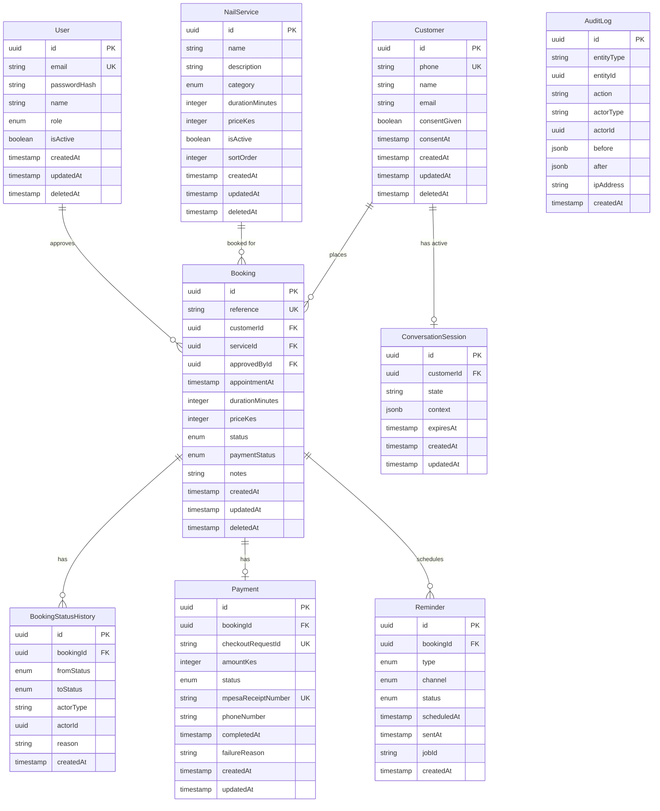

# Database Design — NailBook

**Version:** 1.0  
**Database:** PostgreSQL 18  
**ORM:** Prisma 7

---

## Domain Model

```
NailService ◄──── Booking ────► Customer
                      │
                      ├──► BookingStatusHistory
                      │
                      └──► Payment ────► PaymentTransaction

Customer ──────────────► ConversationSession

Booking ──────────────► Reminder (0..2)

User (staff/owner) ───► AuditLog
```

---

## ERD



---

## Table Definitions

### users

Represents salon staff and owner accounts for the PWA.

```prisma
model User {
  id           String    @id @default(uuid())g
  email        String    @unique
  passwordHash String    @map("password_hash")
  name         String
  role         UserRole  @default(STAFF)
  isActive     Boolean   @default(true) @map("is_active")
  createdAt    DateTime  @default(now()) @map("created_at")
  updatedAt    DateTime  @updatedAt @map("updated_at")
  deletedAt    DateTime? @map("deleted_at")

  approvedBookings Booking[]  @relation("ApprovedBy")
  auditLogs        AuditLog[] @relation("Actor")

  @@map("users")
}

enum UserRole {
  OWNER
  STAFF
}
```

### customers

Represents WhatsApp customers. Phone number is the primary identifier.

```prisma
model Customer {
  id           String    @id @default(uuid())
  phone        String    @unique  // E.164 format: +254712345678
  name         String
  email        String?
  consentGiven Boolean   @default(false) @map("consent_given")
  consentAt    DateTime? @map("consent_at")
  createdAt    DateTime  @default(now()) @map("created_at")
  updatedAt    DateTime  @updatedAt @map("updated_at")
  deletedAt    DateTime? @map("deleted_at")

  bookings            Booking[]
  conversationSession ConversationSession?

  @@map("customers")
}
```

### nail_services

Configurable service catalogue.

```prisma
model NailService {
  id              String    @id @default(uuid())
  name            String
  description     String?
  category        ServiceCategory
  durationMinutes Int       @map("duration_minutes")
  priceKes        Int       @map("price_kes")  // in whole KES, no decimals
  isActive        Boolean   @default(true) @map("is_active")
  sortOrder       Int       @default(0) @map("sort_order")
  createdAt       DateTime  @default(now()) @map("created_at")
  updatedAt       DateTime  @updatedAt @map("updated_at")
  deletedAt       DateTime? @map("deleted_at")

  bookings Booking[]

  @@map("salon_services")
}

enum ServiceCategory {
  MANICURE
  OVERLAY
  PEDICURE
  ACRYLIC
}
```

### bookings

Core booking entity.

```prisma
model Booking {
  id              String        @id @default(uuid())
  reference       String        @unique  // WN-2025-00001
  customerId      String        @map("customer_id")
  serviceId       String        @map("service_id")
  approvedById    String?       @map("approved_by_id")
  appointmentAt   DateTime      @map("appointment_at")  // stored in UTC
  durationMinutes Int           @map("duration_minutes")  // snapshot at booking time
  priceKes        Int           @map("price_kes")  // snapshot at booking time
  status          BookingStatus @default(PENDING)
  paymentStatus   PaymentStatus @default(UNPAID) @map("payment_status")
  notes           String?
  createdAt       DateTime      @default(now()) @map("created_at")
  updatedAt       DateTime      @updatedAt @map("updated_at")
  deletedAt       DateTime?     @map("deleted_at")

  customer    Customer     @relation(fields: [customerId], references: [id])
  service     NailService @relation(fields: [serviceId], references: [id])
  approvedBy  User?        @relation("ApprovedBy", fields: [approvedById], references: [id])
  statusHistory BookingStatusHistory[]
  payment     Payment?
  reminders   Reminder[]

  @@index([customerId])
  @@index([serviceId])
  @@index([appointmentAt])
  @@index([status])
  @@index([paymentStatus])
  @@index([deletedAt])
  @@map("bookings")
}

enum BookingStatus {
  PENDING
  APPROVED
  RESCHEDULED
  COMPLETED
  CANCELLED
  NO_SHOW
}

enum PaymentStatus {
  UNPAID
  PAYMENT_PENDING
  PAID
  PAYMENT_FAILED
  REFUNDED
}
```

### booking_status_history

Immutable audit trail of all booking state transitions.

```prisma
model BookingStatusHistory {
  id         String        @id @default(uuid())
  bookingId  String        @map("booking_id")
  fromStatus BookingStatus? @map("from_status")
  toStatus   BookingStatus @map("to_status")
  actorType  ActorType        @map("actor_type")  // "USER" | "SYSTEM" | "CUSTOMER"
  actorId    String?       @map("actor_id")
  reason     String?
  createdAt  DateTime      @default(now()) @map("created_at")

  booking Booking @relation(fields: [bookingId], references: [id])

  @@index([bookingId])
  @@map("booking_status_history")
}

enum ActorType {
  CUSTOMER
  USER
  SYSTEM
}
```

### payments

One payment record per booking. Tracks the overall payment outcome.

```prisma
model Payment {
  id                 String        @id @default(uuid())
  bookingId          String        @unique @map("booking_id")
  checkoutRequestId  String?       @unique @map("checkout_request_id")
  amountKes          Int           @map("amount_kes")
  status             PaymentStatus @default(UNPAID)
  mpesaReceiptNumber String?       @unique @map("mpesa_receipt_number")
  phoneNumber        String?       @map("phone_number")
  completedAt        DateTime?     @map("completed_at")
  failureReason      String?       @map("failure_reason")
  createdAt          DateTime      @default(now()) @map("created_at")
  updatedAt          DateTime      @updatedAt @map("updated_at")

  booking      Booking              @relation(fields: [bookingId], references: [id])
  transactions PaymentTransaction[]

  @@index([status])
  @@map("payments")
}
```

### payment_transactions

Immutable log of every Daraja API interaction attempt.

```prisma
model PaymentTransaction {
  id                 String   @id @default(uuid())
  paymentId          String   @map("payment_id")
  attemptNumber      Int      @map("attempt_number")
  checkoutRequestId  String?  @map("checkout_request_id")
  resultCode         Int?     @map("result_code")
  resultDesc         String?  @map("result_desc")
  mpesaReceiptNumber String?  @map("mpesa_receipt_number")
  rawRequest         Json?    @map("raw_request")   // sanitised (no passkey)
  rawCallback        Json?    @map("raw_callback")
  createdAt          DateTime @default(now()) @map("created_at")

  payment Payment @relation(fields: [paymentId], references: [id])

  @@index([paymentId])
  @@index([mpesaReceiptNumber])
  @@map("payment_transactions")
}
```

### reminders

Tracks scheduled and sent appointment reminders.

```prisma
model Reminder {
  id          String         @id @default(uuid())
  bookingId   String         @map("booking_id")
  type        ReminderType
  channel     ReminderChannel @default(EMAIL)
  status      ReminderStatus @default(SCHEDULED)
  scheduledAt DateTime       @map("scheduled_at")
  sentAt      DateTime?      @map("sent_at")
  jobId       String?        @map("job_id")  // BullMQ job ID for cancellation
  createdAt   DateTime       @default(now()) @map("created_at")

  booking Booking @relation(fields: [bookingId], references: [id])

  @@index([bookingId])
  @@index([scheduledAt, status])
  @@map("reminders")
}

enum ReminderType    { REMINDER_24H  REMINDER_1H }
enum ReminderChannel { WHATSAPP   EMAIL }
enum ReminderStatus  { SCHEDULED  SENT  FAILED  CANCELLED }
```

### conversation_sessions

Redis is the primary store for active sessions. This table logs completed conversations for analytics.

```prisma
model ConversationSession {
  id         String   @id @default(uuid())
  customerId String   @unique @map("customer_id")
  state      String
  context    Json     @default("{}")
  expiresAt  DateTime @map("expires_at")
  createdAt  DateTime @default(now()) @map("created_at")
  updatedAt  DateTime @updatedAt @map("updated_at")

  customer Customer @relation(fields: [customerId], references: [id])

  @@map("conversation_sessions")
}
```

### audit_logs

Append-only audit trail for all significant system actions.

```prisma
model AuditLog {
  id         String   @id @default(uuid())
  entityType String   @map("entity_type")  // "Booking", "Payment", "Customer"
  entityId   String   @map("entity_id")
  action     String   // "APPROVED", "CANCELLED", "PAYMENT_INITIATED", etc.
  actorType  String   @map("actor_type")   // "USER", "SYSTEM", "CUSTOMER"
  actorId    String?  @map("actor_id")
  before     Json?
  after      Json?
  ipAddress  String?  @map("ip_address")
  createdAt  DateTime @default(now()) @map("created_at")

  @@index([entityType, entityId])
  @@index([actorId])
  @@index([createdAt])
  @@map("audit_logs")
}
```

---

## Relationships Summary

| From | To | Cardinality | FK |
|---|---|---|---|
| Customer | Booking | 1:N | bookings.customer_id |
| NailService | Booking | 1:N | bookings.service_id |
| User | Booking | 1:N (approved_by) | bookings.approved_by_id |
| Booking | BookingStatusHistory | 1:N | booking_status_history.booking_id |
| Booking | Payment | 1:1 | payments.booking_id |
| Payment | PaymentTransaction | 1:N | payment_transactions.payment_id |
| Booking | Reminder | 1:N | reminders.booking_id |
| Customer | ConversationSession | 1:1 | conversation_sessions.customer_id |

---

## Constraints

```sql
-- Prevent double-booking: no two non-cancelled bookings can overlap
-- Implemented as a partial unique index + application-layer check
-- (PostgreSQL doesn't support range overlap constraints natively without btree_gist)
CREATE UNIQUE INDEX bookings_no_overlap_idx
ON bookings (
  date_trunc('minute', appointment_at),
  duration_minutes
)
WHERE status NOT IN ('CANCELLED', 'NO_SHOW') AND deleted_at IS NULL;

-- Reference format constraint
ALTER TABLE bookings
ADD CONSTRAINT bookings_reference_format
CHECK (reference ~ '^NB-[0-9]{4}-[0-9]{5}$');

-- Phone number E.164 format
ALTER TABLE customers
ADD CONSTRAINT customers_phone_e164
CHECK (phone ~ '^\+254[0-9]{9}$');

-- Price must be positive
ALTER TABLE bookings ADD CONSTRAINT bookings_price_positive CHECK (price_kes > 0);
ALTER TABLE salon_services ADD CONSTRAINT services_price_positive CHECK (price_kes > 0);

-- Duration must be positive
ALTER TABLE bookings ADD CONSTRAINT bookings_duration_positive CHECK (duration_minutes > 0);
```

---

## Indexing Strategy

```sql
-- Bookings: common query patterns
CREATE INDEX idx_bookings_appointment_at ON bookings(appointment_at) WHERE deleted_at IS NULL;
CREATE INDEX idx_bookings_status ON bookings(status) WHERE deleted_at IS NULL;
CREATE INDEX idx_bookings_customer_id ON bookings(customer_id);
CREATE INDEX idx_bookings_created_at ON bookings(created_at DESC);

-- Payments: receipt lookup (idempotency)
CREATE UNIQUE INDEX idx_payments_receipt ON payments(mpesa_receipt_number)
  WHERE mpesa_receipt_number IS NOT NULL;

-- Reminders: scheduled reminder processing
CREATE INDEX idx_reminders_scheduled ON reminders(scheduled_at)
  WHERE status = 'SCHEDULED';

-- Audit log: entity history lookups
CREATE INDEX idx_audit_entity ON audit_logs(entity_type, entity_id);
CREATE INDEX idx_audit_created_at ON audit_logs(created_at DESC);

-- Customers: phone lookup (most common auth path)
CREATE UNIQUE INDEX idx_customers_phone ON customers(phone)
  WHERE deleted_at IS NULL;
```

---

## Audit Strategy

Every significant state change produces an `AuditLog` record **before** the change is committed, in the same database transaction. The `before` and `after` JSON snapshots capture the relevant fields — not the entire row (to avoid storing PII unnecessarily).

Booking status changes are **also** written to `booking_status_history` for booking-specific queries.

Payment transaction records are immutable (no UPDATE on `payment_transactions`).

---

## Soft Delete Strategy

All mutable entities have a `deleted_at` nullable timestamp column. "Deleted" records are never returned in application queries (all Prisma calls include `where: { deletedAt: null }`). This is enforced via a global Prisma middleware.

Hard deletes are only performed by a scheduled cleanup job that runs monthly on records with `deleted_at` older than 7 years (Kenya financial data retention requirement). This job writes to the audit log before deletion.

```typescript
// Global Prisma middleware — auto-filter soft-deleted records
const softDeleteModels = ["Booking", "Customer", "NailService", "User"];

prisma.$extends({
  query: {
    $allModels: {
      async findMany({ model, args, query }) {
        if (model && softDeleteModels.includes(model) && args.where) {
          args.where = {
            ...args.where,
            deletedAt: null,
          };
        }

        return query(args);
      },

      async findFirst({ model, args, query }) {
        if (model && softDeleteModels.includes(model) && args.where) {
          args.where = {
            ...args.where,
            deletedAt: null,
          };
        }

        return query(args);
      },
    },
  },
});
```
