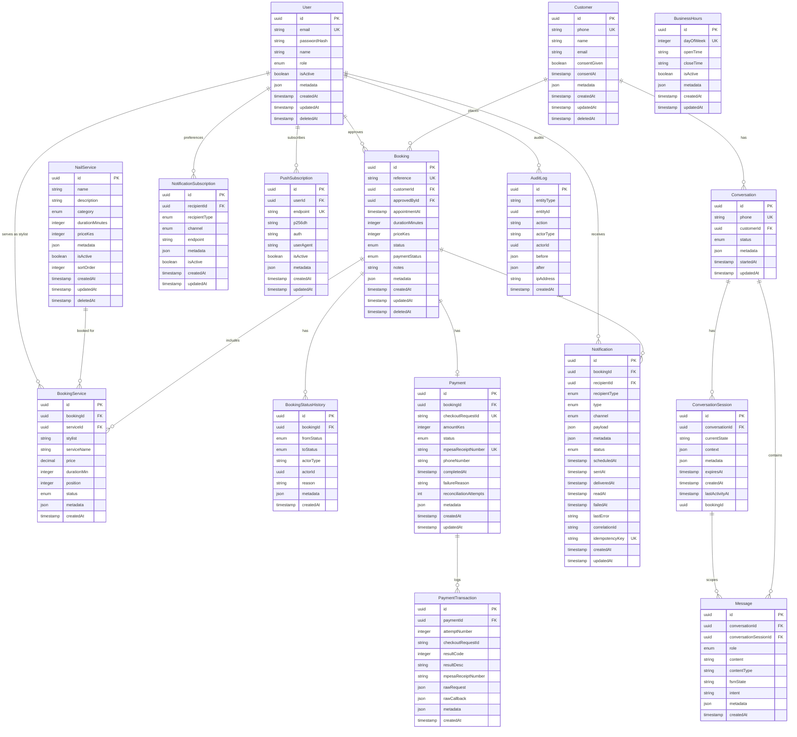

# Database Design — Wanny's Nails

**Version:** 2.0
**Database:** PostgreSQL 18
**ORM:** Prisma 7

---

## Domain Model

```
NailService ◄──── BookingService ────► Booking ────► Customer
                                            │
                                            ├──► BookingStatusHistory
                                            │
                                            ├──► Payment ────► PaymentTransaction
                                            │
                                            └──► Notification

Customer ──────────────► Conversation ────► ConversationSession ────► Message

User (staff/owner) ────► AuditLog
User (staff/owner) ────► PushSubscription
User (staff/owner) ────► Notification
User (staff/owner) ────► NotificationSubscription
User (staff/owner) ────► BookingService (stylist)
```

---

## ERD



---

## Table Definitions

### users

Represents salon staff and owner accounts for the PWA.

```prisma
model User {
  id           String    @id @default(uuid())
  email        String    @unique
  passwordHash String    @map("password_hash")
  name         String
  role         UserRole  @default(STAFF)
  isActive     Boolean   @default(true) @map("is_active")
  metadata    Json?          @default("{}")

  createdAt    DateTime  @default(now()) @map("created_at")
  updatedAt    DateTime  @updatedAt @map("updated_at")
  deletedAt    DateTime? @map("deleted_at")

  approvedBookings       Booking[]                     @relation("approvedBy")
  auditLogs              AuditLog[]                    @relation("Actor")
  notifications          Notification[]                @relation("notificationRecipient")
  notificationSubscriptions NotificationSubscription[] @relation("subscriber")
  pushSubscriptions      PushSubscription[]
  bookingServices        BookingService[]              @relation("stylist")

  @@map("users")
}

enum UserRole {
  OWNER
  STAFF
}
```

### customers

Represents WhatsApp customers. Phone number is the primary identifier.

```prisma
model Customer {
  id           String    @id @default(uuid())
  phone        String    @unique  // E.164 format: +254712345678
  name         String
  email        String?
  consentGiven Boolean   @default(false) @map("consent_given")
  consentAt    DateTime? @map("consent_at")
  metadata    Json?          @default("{}")

  createdAt    DateTime  @default(now()) @map("created_at")
  updatedAt    DateTime  @updatedAt @map("updated_at")
  deletedAt    DateTime? @map("deleted_at")

  bookings     Booking[]
  conversations Conversation[]

  @@map("customers")
}
```

### nail_services

Configurable service catalogue.

```prisma
model NailService {
  id              String    @id @default(uuid())
  name            String
  description     String?
  durationMinutes Int       @map("duration_minutes")
  priceKes        Int       @map("price_kes")  // in whole KES, no decimals
  category        ServiceCategory
  metadata        Json?     @default("{}")
  isActive        Boolean   @default(true) @map("is_active")
  sortOrder       Int       @default(0) @map("sort_order")
  createdAt       DateTime  @default(now()) @map("created_at")
  updatedAt       DateTime  @updatedAt @map("updated_at")
  deletedAt       DateTime? @map("deleted_at")

  bookingServices BookingService[]

  @@map("nail_services")
}

enum ServiceCategory {
  MANICURE      // Natural nail care
  PEDICURE      // Foot and toenail care
  ENHANCEMENTS  // Overlays, gel overlays, acrylic overlays, BIAB, hard gel
  NAIL_ART      // Designs, rhinestones, chrome, hand painting, etc
  EXTENSIONS    // Tips, sculpted acrylics, Gel-X, soft gel extensions
  REMOVAL       // Removing existing products
  REPAIR        // Fixing broken or damaged nails
  TREATMENT     // Nail health treatments, paraffin wax, strengthening treatments, cuticle therapy
}
```

### bookings

Core booking entity. Services are linked through the BookingService join table (many-to-many).

```prisma
model Booking {
  id              String        @id @default(uuid())
  reference       String        @unique  // WN-2026-00001
  customerId      String        @map("customer_id")
  approvedById    String?       @map("approved_by_id")
  appointmentAt   DateTime      @map("appointment_at")  // stored in UTC
  durationMinutes Int           @map("duration_minutes")  // snapshot: sum of all service durations at booking time
  priceKes        Int           @map("price_kes")  // snapshot: sum of all service prices at booking time
  status          BookingStatus @default(PENDING)
  paymentStatus   PaymentStatus @default(PENDING) @map("payment_status")
  notes           String?
  metadata        Json?          @default("{}")
  createdAt       DateTime      @default(now()) @map("created_at")
  updatedAt       DateTime      @updatedAt @map("updated_at")
  deletedAt       DateTime?     @map("deleted_at")

  customer        Customer      @relation(fields: [customerId], references: [id])
  approvedBy      User?         @relation("approvedBy", fields: [approvedById], references: [id])

  statusHistory   BookingStatusHistory[]
  payment         Payment?
  services        BookingService[]
  notifications   Notification[]

  @@index([customerId])
  @@index([appointmentAt])
  @@index([status])
  @@index([paymentStatus])
  @@index([deletedAt])
  @@map("bookings")
}

enum BookingStatus {
  PENDING
  APPROVED
  RESCHEDULED
  COMPLETED
  CANCELLED
  NO_SHOW
}

enum PaymentStatus {
  PENDING
  SUCCESS
  FAILED
  CANCELLED
  EXPIRED
  REFUNDED
  RECONCILING  // transient: callback received, side effects not yet committed
}
```

### booking_services

Join table linking bookings to services. Snapshots service details at booking time.

```prisma
model BookingService {
  id          String   @id @default(uuid())
  bookingId   String   @map("booking_id")
  serviceId   String   @map("service_id")
  stylist     String   // User.id — assigned staff member
  metadata    Json?    @default("{}")

  // Snapshotted fields — capture price/duration AT TIME OF BOOKING
  serviceName String   @map("service_name") // in case service gets renamed/removed later
  price       Decimal  @db.Decimal(10, 2)  // KES amount at booking time, not live-referenced
  durationMin Int      @map("duration_min")// duration at booking time, for slot calculation

  // Ordering, since a customer picks multiple services in sequence
  position    Int      // 0, 1, 2... determines order services are performed
  // Per-service status tracking (useful if staff mark each service done independently)
  status      ServiceStatus @default(PENDING) // PENDING, IN_PROGRESS, COMPLETED, CANCELLED

  booking     Booking      @relation(fields: [bookingId], references: [id], onDelete: Cascade)
  service     NailService  @relation(fields: [serviceId], references: [id])
  user        User         @relation("stylist", fields: [stylist], references: [id])

  createdAt   DateTime     @default(now()) @map("created_at")

  @@index([bookingId])
  @@index([serviceId])
  @@map("booking_services")
}

enum ServiceStatus {
  PENDING
  IN_PROGRESS
  COMPLETED
  CANCELLED
}
```

### booking_status_history

Immutable audit trail of all booking state transitions.

```prisma
model BookingStatusHistory {
  id         String         @id @default(uuid())
  bookingId  String         @map("booking_id")
  fromStatus BookingStatus? @map("from_status")
  toStatus   BookingStatus  @map("to_status")
  actorType  String         @map("actor_type")  // "USER" | "SYSTEM" | "CUSTOMER"
  actorId    String?        @map("actor_id")
  reason     String?
  metadata    Json?          @default("{}")
  createdAt  DateTime       @default(now()) @map("created_at")

  booking Booking @relation(fields: [bookingId], references: [id])

  @@index([bookingId])
  @@map("booking_status_history")
}
```

### payments

One payment record per booking. Tracks the overall payment outcome.

```prisma
model Payment {
  id                 String        @id @default(uuid())
  bookingId          String        @unique @map("booking_id")
  checkoutRequestId  String?       @unique @map("checkout_request_id")
  amountKes          Int           @map("amount_kes")
  status             PaymentStatus @default(PENDING)
  mpesaReceiptNumber String?       @unique @map("mpesa_receipt_number")
  phoneNumber        String?       @map("phone_number")
  completedAt        DateTime?     @map("completed_at")
  failureReason      String?       @map("failure_reason")
  reconciliationAttempts      Int      @map("reconciliation_attempts") @default(0)

  metadata           Json?          @default("{}")

  createdAt          DateTime      @default(now()) @map("created_at")
  updatedAt          DateTime      @updatedAt @map("updated_at")

  booking      Booking              @relation(fields: [bookingId], references: [id])
  transactions PaymentTransaction[]

  @@index([status])
  @@map("payments")
}
```

### payment_transactions

Immutable log of every Daraja API interaction attempt.

```prisma
model PaymentTransaction {
  id                 String   @id @default(uuid())
  paymentId          String   @map("payment_id")
  attemptNumber      Int      @map("attempt_number")
  checkoutRequestId  String?  @map("checkout_request_id")
  resultCode         Int?     @map("result_code")
  resultDesc         String?  @map("result_desc")
  mpesaReceiptNumber String?  @map("mpesa_receipt_number")
  rawRequest         Json?    @map("raw_request")   // sanitised (no passkey)
  rawCallback        Json?    @map("raw_callback")
  metadata           Json?    @default("{}")

  createdAt          DateTime @default(now()) @map("created_at")

  payment Payment @relation(fields: [paymentId], references: [id])

  @@index([paymentId])
  @@index([mpesaReceiptNumber])
  @@map("payment_transactions")
}
```

### notifications

Tracks all outbound notifications (WhatsApp, email, push).

```prisma
model Notification {
  id              String               @id @default(uuid())
  bookingId       String               @map("booking_id")
  recipientId     String               @map("recipient_id")
  recipientType   NotificationRecipient @map("recipient_type")
  type            NotificationType
  channel         NotificationChannel  @default(EMAIL)
  payload         Json
  metadata        Json?                @default("{}")
  status          NotificationStatus   @default(PENDING)
  scheduledAt     DateTime?            @map("scheduled_at")
  sentAt          DateTime?            @map("sent_at")
  deliveredAt     DateTime?            @map("delivered_at")
  readAt          DateTime?            @map("read_at")
  failedAt        DateTime?            @map("failed_at")
  lastError       String?              @map("last_error")
  correlationId   String?              @map("correlation_id")
  idempotencyKey  String               @unique @map("idempotency_key")
  createdAt       DateTime             @default(now()) @map("created_at")
  updatedAt       DateTime             @updatedAt @map("updated_at")

  booking   Booking  @relation(fields: [bookingId], references: [id])
  recipient User?    @relation("notificationRecipient", fields: [recipientId], references: [id])

  @@index([bookingId])
  @@index([scheduledAt, status])
  @@index([recipientType, recipientId])
  @@index([idempotencyKey])
  @@map("notifications")
}
```

### notification_subscriptions

Stores delivery preferences per recipient.

```prisma
model NotificationSubscription {
  id            String                @id @default(uuid())
  recipientId   String                @map("recipient_id") // Owner, staff, or customer
  recipientType NotificationRecipient @map("recipient_type")
  channel       NotificationChannel
  endpoint      String  // phone number (E.164 no plus sign) | push endpoint URL | email address
  metadata      Json?                 @default("{}")
  isActive      Boolean               @map("is_active") @default(false)

  createdAt  DateTime @default(now()) @map("created_at")
  updatedAt  DateTime @updatedAt @map("updated_at")

  recipient User? @relation("subscriber", fields: [recipientId], references: [id])

  @@unique([recipientId, channel, endpoint])
  @@index([recipientType, recipientId, channel])
  @@map("notification_subscriptions")
}
```

### push_subscriptions

Web push subscriptions for PWA notifications.

```prisma
model PushSubscription {
  id        String   @id @default(uuid())
  userId    String
  endpoint  String   @unique
  p256dh    String
  auth      String
  userAgent String?  @map("user_agent")
  isActive  Boolean  @default(true) @map("is_active")
  metadata  Json?     @default("{}")
  createdAt DateTime @default(now()) @map("created_at")
  updatedAt          DateTime      @updatedAt @map("updated_at")

  user User @relation(fields: [userId], references: [id])

  @@index([userId])
  @@map("push_subscriptions")
}
```

### conversations

Tracks WhatsApp conversation threads per phone number.

```prisma
model Conversation {
  id            String   @id @default(uuid())
  phone         String   @unique // one conversation per phone
  customerId    String?
  customer      Customer? @relation(fields: [customerId], references: [id])
  status        ConversationStatus @default(ACTIVE)
  metadata      Json?       @default("{}")
  startedAt     DateTime @default(now()) @map("started_at")
  updatedAt     DateTime @updatedAt @map("updated_at")

  messages      Message[]
  conversationSessions  ConversationSession[]
  @@map("conversations")
}

enum ConversationStatus {
  ACTIVE
  IDLE
  CLOSED
}
```

### conversation_sessions

Tracks FSM state per conversation. Redis is the primary store for active sessions; this table logs completed sessions for analytics.

```prisma
model ConversationSession {
  id         String   @id @default(uuid())
  conversationId String
  conversation   Conversation @relation(fields: [conversationId], references: [id])

  currentState String  @map("current_state")
  context    Json     @default("{}") // memory and slot filling
  metadata   Json     @default("{}")
  expiresAt  DateTime @map("expires_at")
  createdAt  DateTime @default(now()) @map("created_at")
  lastActivityAt  DateTime @updatedAt @map("last_activity_at")

  bookingId      String?  // set if this session resulted in a booking
  messages       Message[] // messages scoped to this specific attempt

  @@index([conversationId])
  @@map("conversation_sessions")
}
```

### messages

Stores both inbound and outbound WhatsApp/Web messages.

```prisma
model Message {
  id             String   @id @default(uuid())
  conversationId String
  conversation   Conversation @relation(fields: [conversationId], references: [id], onDelete: Cascade)
  conversationSessionId String?
  conversationSession   ConversationSession? @relation(fields: [conversationSessionId], references: [id])

  role           MessageRole // USER, BOT, SYSTEM
  content        String      @db.Text
  contentType    String      @default("text") // text, image, location, interactive_reply
  fsmState       String?  // snapshot at send-time — mirrors session.currentState but frozen
  intent         String?
  metadata       Json?       @default("{}")
  createdAt      DateTime    @default(now())

  @@index([conversationId, createdAt])
  @@index([conversationSessionId])
  @@map("messages")
}

enum MessageRole {
  USER
  BOT
  SYSTEM
}
```

### audit_logs

Append-only audit trail for all significant system actions.

```prisma
model AuditLog {
  id         String   @id @default(uuid())
  entityType String   @map("entity_type")  // "Booking", "Payment", "Customer"
  entityId   String   @map("entity_id")
  action     String   // "APPROVED", "CANCELLED", "PAYMENT_INITIATED", etc.
  actorType  String   @map("actor_type")   // "USER", "SYSTEM", "CUSTOMER"
  actorId    String?  @map("actor_id")
  before     Json?
  after      Json?
  ipAddress  String?  @map("ip_address")
  createdAt  DateTime @default(now()) @map("created_at")

  actor User? @relation("Actor", fields: [actorId], references: [id])

  @@index([entityType, entityId])
  @@index([actorId])
  @@index([createdAt])
  @@map("audit_logs")
}
```

### business_hours

Defines salon operating hours per day of week.

```prisma
model BusinessHours {
  id         String   @id @default(uuid())
  dayOfWeek  Int      @map("day_of_week") // 0=Sunday, 6=Saturday
  openTime   String   @map("open_time") // "07:00"
  closeTime  String   @map("close_time") // "19:00"
  isActive   Boolean  @default(true) @map("is_active")
  metadata    Json?          @default("{}")

  createdAt  DateTime @default(now()) @map("created_at")
  updatedAt  DateTime @updatedAt @map("updated_at")

  @@unique([dayOfWeek])
  @@map("business_hours")
}
```

---

## Relationships Summary

| From | To | Cardinality | FK |
|---|---|---|---|
| Customer | Booking | 1:N | bookings.customer_id |
| NailService | BookingService | 1:N | booking_services.service_id |
| Booking | BookingService | 1:N | booking_services.booking_id |
| User | BookingService (stylist) | 1:N | booking_services.stylist |
| User | Booking | 1:N (approved_by) | bookings.approved_by_id |
| Booking | BookingStatusHistory | 1:N | booking_status_history.booking_id |
| Booking | Payment | 1:1 | payments.booking_id |
| Payment | PaymentTransaction | 1:N | payment_transactions.payment_id |
| Booking | Notification | 1:N | notifications.booking_id |
| User | Notification | 1:N | notifications.recipient_id |
| User | PushSubscription | 1:N | push_subscriptions.user_id |
| User | NotificationSubscription | 1:N | notification_subscriptions.recipient_id |
| Customer | Conversation | 1:N | conversations.customer_id |
| Conversation | ConversationSession | 1:N | conversation_sessions.conversation_id |
| Conversation | Message | 1:N | messages.conversation_id |
| ConversationSession | Message | 1:N | messages.conversation_session_id |
| User | AuditLog | 1:N | audit_logs.actor_id |

---

## Enum Values

### PaymentStatus
| Value | Description |
|---|---|
| PENDING | Awaiting payment initiation |
| SUCCESS | Payment completed successfully |
| FAILED | Payment failed |
| CANCELLED | Payment was cancelled |
| EXPIRED | STK push timed out |
| REFUNDED | Payment refunded |
| RECONCILING | Callback received, side effects not yet committed |

### ServiceStatus
| Value | Description |
|---|---|
| PENDING | Service not yet started |
| IN_PROGRESS | Service being performed |
| COMPLETED | Service completed |
| CANCELLED | Service cancelled |

### NotificationType
| Value | Description |
|---|---|
| BOOKING_CREATED | Booking created by customer |
| BOOKING_PENDING_CONFIRMATION | Awaiting staff approval |
| BOOKING_CONFIRMED | Booking approved |
| BOOKING_REJECTED | Booking rejected |
| BOOKING_CANCELLED | Booking cancelled |
| BOOKING_RESCHEDULED | Booking rescheduled |
| BOOKING_COMPLETED | Service completed |
| BOOKING_NO_SHOW | Customer no-show |
| APPOINTMENT_REMINDER | 24h or 1h reminder |
| PAYMENT_REQUEST | Payment requested |
| PAYMENT_RECEIVED | Payment received |
| PAYMENT_REFUNDED | Payment refunded |
| PAYMENT_SUCCESS | Payment successful |
| PAYMENT_FAILED | Payment failed |
| PAYMENT_EXPIRED | Payment expired |
| REVIEW_RECEIPT | Receipt for review |
| FEEDBACK_REQUEST | Request for feedback |
| REVIEW_REQUEST | Request for review |

---

## Constraints

```sql
-- Prevent double-booking: no two non-cancelled bookings can overlap
-- Implemented as application-layer check with Serializable isolation
-- (PostgreSQL doesn't support range overlap constraints natively without btree_gist)

-- Reference format constraint
ALTER TABLE bookings
ADD CONSTRAINT bookings_reference_format
CHECK (reference ~ '^WN-[0-9]{4}-[0-9]{5}$');

-- Phone number E.164 format
ALTER TABLE customers
ADD CONSTRAINT customers_phone_e164
CHECK (phone ~ '^\+254[0-9]{9}$');

-- Price must be positive
ALTER TABLE bookings ADD CONSTRAINT bookings_price_positive CHECK (price_kes > 0);
ALTER TABLE nail_services ADD CONSTRAINT services_price_positive CHECK (price_kes > 0);

-- Duration must be positive
ALTER TABLE bookings ADD CONSTRAINT bookings_duration_positive CHECK (duration_minutes > 0);
```

---

## Indexing Strategy

```sql
-- Bookings: common query patterns
CREATE INDEX idx_bookings_appointment_at ON bookings(appointment_at) WHERE deleted_at IS NULL;
CREATE INDEX idx_bookings_status ON bookings(status) WHERE deleted_at IS NULL;
CREATE INDEX idx_bookings_customer_id ON bookings(customer_id);
CREATE INDEX idx_bookings_created_at ON bookings(created_at DESC);

-- Payments: receipt lookup (idempotency)
CREATE UNIQUE INDEX idx_payments_receipt ON payments(mpesa_receipt_number)
  WHERE mpesa_receipt_number IS NOT NULL;

-- Notifications: scheduled notification processing
CREATE INDEX idx_notifications_scheduled ON notifications(scheduled_at)
  WHERE status = 'SCHEDULED';

-- Audit log: entity history lookups
CREATE INDEX idx_audit_entity ON audit_logs(entity_type, entity_id);
CREATE INDEX idx_audit_created_at ON audit_logs(created_at DESC);

-- Customers: phone lookup (most common auth path)
CREATE UNIQUE INDEX idx_customers_phone ON customers(phone)
  WHERE deleted_at IS NULL;
```

---

## Audit Strategy

Every significant state change produces an `AuditLog` record **before** the change is committed, in the same database transaction. The `before` and `after` JSON snapshots capture the relevant fields — not the entire row (to avoid storing PII unnecessarily).

Booking status changes are **also** written to `booking_status_history` for booking-specific queries.

Payment transaction records are immutable (no UPDATE on `payment_transactions`).

---

## Soft Delete Strategy

All mutable entities have a `deleted_at` nullable timestamp column. "Deleted" records are never returned in application queries (all Prisma calls include `where: { deletedAt: null }`). This is enforced via a global Prisma middleware.

Hard deletes are only performed by a scheduled cleanup job that runs monthly on records with `deleted_at` older than 7 years (Kenya financial data retention requirement). This job writes to the audit log before deletion.

```typescript
// Global Prisma middleware — auto-filter soft-deleted records
const softDeleteModels = ["Booking", "Customer", "NailService", "User"];

prisma.$extends({
  query: {
    $allModels: {
      async findMany({ model, args, query }) {
        if (model && softDeleteModels.includes(model) && args.where) {
          args.where = {
            ...args.where,
            deletedAt: null,
          };
        }

        return query(args);
      },

      async findFirst({ model, args, query }) {
        if (model && softDeleteModels.includes(model) && args.where) {
          args.where = {
            ...args.where,
            deletedAt: null,
          };
        }

        return query(args);
      },
    },
  },
});