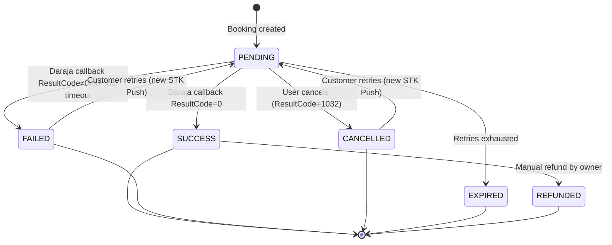
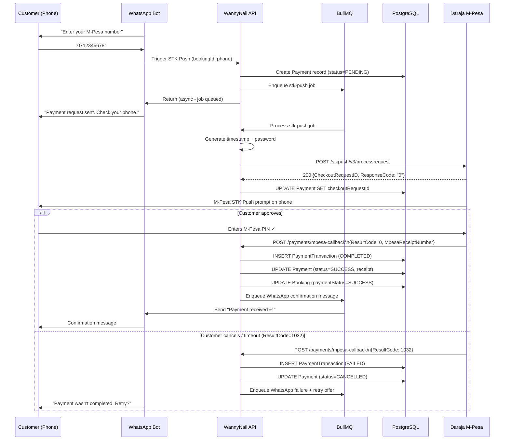

# Payment Workflow — NailBook

**Version:** 1.1  
**Payment Provider:** Safaricom M-Pesa Daraja API v3  
**Transaction Type:** Lipa na M-Pesa (STK Push / CustomerPayBillOnline)

---

## Overview

Payments in Wanny's Nails are initiated via M-Pesa STK Push after a customer confirms their booking in the WhatsApp flow. The customer receives a payment prompt on their phone, enters their M-Pesa PIN, and the result is delivered asynchronously to the backend via a Daraja callback.

All payment initiation is handled asynchronously via BullMQ for async/retry-safe processing, and an admin PWA for visibility and reconciliation.

This document describes the **system as it should behave in production** — correct under network failures, callback duplication, race conditions, and partial outages.

---

## Table of Contents

1. [Design Principles](#1-design-principles)
2. [Payment Lifecycle & State Machine](#2-payment-lifecycle--state-machine)
3. [Data Model](#3-data-model)
4. [STK Push Initiation](#4-stk-push-initiation)
5. [Callback Handling](#5-callback-handling)
6. [Timeout & Retry Strategy (BullMQ)](#6-timeout--retry-strategy-bullmq)
7. [Idempotency & Concurrency Control](#7-idempotency--concurrency-control)
8. [Slot Locking During Payment](#8-slot-locking-during-payment)
9. [Reconciliation](#9-reconciliation)
10. [Admin PWA: Payment Visibility](#10-admin-pwa-payment-visibility)
11. [Security](#11-security)
12. [Observability](#12-observability)
13. [Failure Modes & How the System Survives Them](#13-failure-modes--how-the-system-survives-them)
14. [Environment Variables](#14-environment-variables)

---

## 1. Design Principles

A payment system fails quietly if you let it. Three rules drive every decision below:

- **The callback is the source of truth, not the STK push response.** Daraja's synchronous STK push response only confirms the *prompt was sent* — it says nothing about whether the customer paid. Never mark a booking as paid from that response.
- **Every write that can be retried, will be retried — by Safaricom, by your own queue, by a customer double-tapping a WhatsApp button.** Every payment-mutating operation must be idempotent.
- **Money state and booking state are separate state machines that must stay reconciled, not merged.** A booking can be `CONFIRMED` while a payment is `PENDING` (cash on arrival) — don't conflate "booking confirmed" with "payment received."

---

## 2. Payment Lifecycle & State Machine



### M-Pesa STK Push Flow



Terminal states: `SUCCESS` (reconciled), `FAILED`, `CANCELLED`, `EXPIRED` (timed out with no resolution after retries exhausted).

A `Payment` row is **never deleted** — failed/cancelled/expired attempts are retained for audit and to support "customer says they paid" support disputes against M-Pesa statements.

---

## 3. Data Model

The actual Prisma schema in `apps/packages/prisma/schema.prisma` defines:

```prisma
enum PaymentStatus {
  PENDING
  SUCCESS
  FAILED
  CANCELLED
  EXPIRED
  REFUNDED
  RECONCILING   // transient: callback received, side effects not yet committed
}

model Payment {
  id                 String        @id @default(uuid())
  bookingId          String        @unique @map("booking_id")
  checkoutRequestId  String?       @unique @map("checkout_request_id")
  amountKes          Int           @map("amount_kes")
  status             PaymentStatus @default(PENDING)
  mpesaReceiptNumber String?       @unique @map("mpesa_receipt_number")
  phoneNumber        String?       @map("phone_number")
  completedAt        DateTime?     @map("completed_at")
  failureReason      String?       @map("failure_reason")
  metadata           Json?         @default("{}")

  createdAt          DateTime      @default(now()) @map("created_at")
  updatedAt          DateTime      @updatedAt @map("updated_at")

  booking      Booking              @relation(fields: [bookingId], references: [id])
  transactions PaymentTransaction[]

  @@index([status])
  @@map("payments")
}

model PaymentTransaction {
  id                 String   @id @default(uuid())
  paymentId          String   @map("payment_id")
  attemptNumber      Int      @map("attempt_number")
  checkoutRequestId  String?  @map("checkout_request_id")
  resultCode         Int?     @map("result_code")
  resultDesc         String?  @map("result_desc")
  mpesaReceiptNumber String?  @map("mpesa_receipt_number")
  rawRequest         Json?    @map("raw_request")
  rawCallback        Json?    @map("raw_callback")
  metadata           Json?    @default("{}")
  
  createdAt          DateTime @default(now()) @map("created_at")

  payment Payment @relation(fields: [paymentId], references: [id])

  @@index([paymentId])
  @@index([mpesaReceiptNumber])
  @@map("payment_transactions")
}
```

Key decisions baked into this schema:

- **`checkoutRequestId` is unique and indexed** — it's the correlation key between the STK push request and the asynchronous callback. Every callback lookup goes through this field.
- **`mpesaReceiptNumber` is unique** — if Safaricom redelivers the same callback (which it does), a unique constraint on the receipt number gives you a database-level idempotency guarantee even if your application-level check has a bug.
- **`rawCallback` is stored, not discarded.** When a customer disputes a charge weeks later, you need the original payload, not your interpretation of it.

---

## 4. STK Push Initiation

### 4.1 OAuth Token Caching

Daraja access tokens last 1 hour. Don't request a new one per payment — cache it in Redis.

```typescript
// apps/workers/payment/src/lib/auth.ts
import { redis } from "./redis";

const TOKEN_CACHE_KEY = "mpesa:access_token";
const TOKEN_TTL_BUFFER_SECONDS = 120; // refresh 2 min early

export async function getAccessToken(): Promise<string> {
  const cached = await redis.get(TOKEN_CACHE_KEY);
  if (cached) return cached;

  const credentials = Buffer.from(
    `${process.env.DARAJA_CONSUMER_KEY}:${process.env.DARAJA_CONSUMER_SECRET}`
  ).toString("base64");

  const response = await fetch(
    `${process.env.DARAJA_BASE_URL}/oauth/v1/generate?grant_type=client_credentials`,
    { headers: { Authorization: `Basic ${credentials}` } }
  );

  if (!response.ok) {
    throw new Error(`Daraja token request failed: ${response.status}`);
  }

  const { access_token, expires_in } = await response.json();

  // Cache for (expires_in - buffer) so we never serve a stale token
  await redis.set(
    TOKEN_CACHE_KEY,
    access_token,
    "EX",
    Number(expires_in) - TOKEN_TTL_BUFFER_SECONDS
  );

  return access_token;
}
```

### 4.2 Initiating the Push

**Why create the `Payment` row first, synchronously, before the HTTP call:** the alternative — creating it after a successful response — has a window where a charge could be in flight with zero record of it existing. A `PENDING` row that never resolves is recoverable (reconciliation finds it); a charge with no row at all is not.

```typescript
// apps/workers/payment/src/processors/stk-push.processor.ts
export async function initiateStkPush(params: {
  bookingId: string;
  phoneNumber: string; // already normalized to 2547XXXXXXXX
  amount: number;
}): Promise<Payment> {
  const { bookingId, phoneNumber, amount } = params;

  const token = await getAccessToken();
  const timestamp = generateDarajaTimestamp(); // YYYYMMDDHHmmss
  const password = Buffer.from(
    `${process.env.DARAJA_SHORTCODE}${process.env.DARAJA_PASSKEY}${timestamp}`
  ).toString("base64");

  // Create the Payment row BEFORE calling Daraja — if the process crashes
  // between the API call and the DB write, you have an orphaned charge
  // with no record. Creating first means worst case is a PENDING row
  // that never gets a checkoutRequestId, which reconciliation (§9) catches.
  const payment = await prisma.payment.create({
    data: { bookingId, phoneNumber, amountKes: amount, status: "PENDING" },
  });

  try {
    const response = await fetch(
      `${process.env.DARAJA_BASE_URL}/mpesa/stkpush/v1/processrequest`,
      {
        method: "POST",
        headers: {
          Authorization: `Bearer ${token}`,
          "Content-Type": "application/json",
        },
        body: JSON.stringify({
          BusinessShortCode: process.env.DARAJA_SHORTCODE,
          Password: password,
          Timestamp: timestamp,
          TransactionType: "CustomerPayBillOnline",
          Amount: amount,
          PartyA: phoneNumber,
          PartyB: process.env.DARAJA_SHORTCODE,
          PhoneNumber: phoneNumber,
          CallBackURL: process.env.DARAJA_CALLBACK_URL,
          AccountReference: `WANNY-${bookingId.slice(-8).toUpperCase()}`,
          TransactionDesc: "Nail appointment booking",
        }),
      }
    );

    const data = await response.json();

    if (data.ResponseCode !== "0") {
      // Synchronous rejection (bad request, invalid shortcode, etc.) —
      // no callback will ever arrive for this attempt.
      await prisma.payment.update({
        where: { id: payment.id },
        data: { status: "FAILED", failureReason: data.ResponseDescription },
      });
      throw new Error(`STK push rejected: ${data.ResponseDescription}`);
    }

    return await prisma.payment.update({
      where: { id: payment.id },
      data: {
        checkoutRequestId: data.CheckoutRequestID,
        metadata: { merchantRequestId: data.MerchantRequestID },
      },
    });
  } catch (err) {
    // Network failure talking to Daraja — we don't know if Safaricom
    // received the request. Leave status PENDING; the timeout job (§6)
    // and reconciliation sweep (§9) will resolve it via the Query API.
    logger.error({ err, paymentId: payment.id }, "STK push request failed");
    throw err;
  }
}
```

**Phone number normalisation:**

```typescript
// apps/packages/src/utils/phone.ts
function normalisePhone(phone: string): string {
  // Accepts: 0712345678, +254712345678, 254712345678, 0112345678
  // Returns: 254712345678 (Daraja format — no leading +)
  const digits = phone.replace(/\D/g, '');
  if (digits.startsWith('0')) return '254' + digits.slice(1);
  if (digits.startsWith('+254')) return digits.slice(1);
  if (digits.startsWith('254')) return digits;
  throw new ValidationError('INVALID_PHONE', 'Phone number must be a valid Kenyan number');
}
```

### STK Push Request Interface

```typescript
interface StkPushRequest {
  BusinessShortCode: string;     // Paybill/Till number
  Password: string;               // Base64(shortcode + passkey + timestamp)
  Timestamp: string;              // YYYYMMDDHHMMSS (EAT)
  TransactionType: 'CustomerPayBillOnline' | 'CustomerBuyGoodsOnline';
  Amount: number;                 // Whole KES, no decimals
  PartyA: string;                 // Customer's phone: 2547XXXXXXXX
  PartyB: string;                 // Same as BusinessShortCode
  PhoneNumber: string;            // Same as PartyA
  CallBackURL: string;            // https://api.nailbook.co.ke/api/v1/payments/mpesa-callback
  AccountReference: string;       // Booking reference: NB-2025-00123 (max 12 chars)
  TransactionDesc: string;        // Max 13 chars: "Nail booking"
}
```

---

## 5. Callback Handling

This is the highest-risk part of the system. Daraja **will** redeliver callbacks, deliver them out of order relative to your own timeout jobs, and occasionally deliver them with delays of several minutes.

Daraja expects a 200 within its timeout window regardless of how long your processing takes. Acknowledge immediately, process async.

Hand off to a queue instead of processing inline. The HTTP handler's only job is to acknowledge receipt and enqueue — never to mutate payment state directly. This means a slow downstream side effect (e.g. WhatsApp API call) can never cause Daraja to see a timeout and redeliver, compounding the duplicate-handling problem.

### Callback Endpoint

`POST /api/v1/payments/mpesa-callback`

This endpoint is public (no JWT) but protected by:
1. IP allowlist — only accepts requests from Safaricom's Daraja IP ranges
2. Request body structure validation

### Processing Logic

```typescript
// apps/workers/payment/src/processors/stk-callback.processor.ts
export async function processStkCallback(job: Job<StkCallbackJobData>) {
  const { callback } = job.data;
  const { CheckoutRequestID, ResultCode, ResultDesc, CallbackMetadata } = callback;

  await prisma.$transaction(async (tx) => {
    const payment = await tx.payment.findUnique({
      where: { checkoutRequestId: CheckoutRequestID },
    });

    if (!payment) {
      // Callback arrived for a CheckoutRequestID we don't recognize —
      // either a race with the STK push write, or a stale/replayed
      // callback from a previous deploy/environment. Don't throw;
      // throwing triggers a BullMQ retry that will never succeed.
      logger.error({ CheckoutRequestID }, "Callback for unknown payment");
      return;
    }

    // Idempotency guard: if we've already processed this exact callback
    // (e.g. Daraja redelivered, or our own job retried after a crash
    // post-DB-write but pre-acknowledgment), skip side effects entirely.
    if (payment.completedAt) {
      logger.info({ paymentId: payment.id }, "Duplicate callback ignored");
      return;
    }

    // Also terminal-state guard: never let a late/duplicate FAILED
    // callback overwrite an already-SUCCESS payment.
    if (["SUCCESS", "FAILED", "CANCELLED", "EXPIRED"].includes(payment.status)) {
      logger.info({ paymentId: payment.id, status: payment.status }, "Payment already terminal, ignoring callback");
      return;
    }

    if (ResultCode === 0) {
      const amount = extractMetadata(CallbackMetadata, 'Amount');
      const receiptNumber = extractMetadata(CallbackMetadata, 'MpesaReceiptNumber');
      const transactionDate = extractMetadata(CallbackMetadata, 'TransactionDate');

      // Amount verification
      if (amount !== payment.amountKes) {
        // Flag as disputed, alert owner
        await tx.payment.update({
          where: { id: payment.id },
          data: {
            status: "FAILED",
            failureReason: `Amount mismatch: expected ${payment.amountKes}, received ${amount}`,
          },
        });
        await alertOwner('PAYMENT_AMOUNT_MISMATCH', payment);
        return;
      }

      // Successful payment
      await tx.paymentTransaction.create({
        data: {
          paymentId: payment.id,
          attemptNumber: await getAttemptNumber(payment.id),
          checkoutRequestId: CheckoutRequestID,
          resultCode: 0,
          resultDesc: ResultDesc,
          mpesaReceiptNumber: receiptNumber,
          rawCallback: callback as any,
        },
      });

      await tx.payment.update({
        where: { id: payment.id },
        data: {
          status: "SUCCESS",
          mpesaReceiptNumber: receiptNumber,
          completedAt: parseDarajaDate(transactionDate),
        },
      });

      await tx.booking.update({
        where: { id: payment.bookingId },
        data: { paymentStatus: "SUCCESS" },
      });
    } else {
      // Failed payment — ResultCode 1032 = user cancelled, 1037 = timeout on user end, etc.
      const terminalStatus = ResultCode === 1032 ? "CANCELLED" : "FAILED";

      await tx.paymentTransaction.create({
        data: {
          paymentId: payment.id,
          attemptNumber: await getAttemptNumber(payment.id),
          checkoutRequestId: CheckoutRequestID,
          resultCode: ResultCode,
          resultDesc: ResultDesc,
          rawCallback: callback as any,
        },
      });

      await tx.payment.update({
        where: { id: payment.id },
        data: {
          status: terminalStatus,
          failureReason: `ResultCode ${ResultCode}: ${ResultDesc}`,
        },
      });
    }
  });

  // Side effects (WhatsApp confirmation, slot release) happen AFTER the
  // transaction commits, in a separate job — never inside the DB
  // transaction. Keeps the transaction short and avoids holding a row
  // lock while waiting on an external API.
  if (ResultCode === 0) {
    await notificationQueue.add('whatsapp-payment-confirmed', {
      phone: payment.booking.customer.phone,
      bookingRef: payment.booking.reference,
      amountKes: payment.amountKes,
    });
  } else {
    await notificationQueue.add('whatsapp-payment-failed', {
      phone: payment.booking.customer.phone,
      resultCode: ResultCode,
      bookingRef: payment.booking.reference,
    });
  }
}
```

**Why acknowledge before processing, and why queue instead of inline:** Safaricom's callback delivery has its own timeout and retry behavior. If your handler is slow (DB transaction + WhatsApp API call + Redis update, all synchronously, on the request thread), you risk Daraja timing out and redelivering — which without the idempotency guards above would have caused you to process the same payment twice concurrently.

**Why the DB transaction matters here specifically:** updating `Payment.status` and `Booking.paymentStatus` must be atomic. A crash between the two writes is exactly how you get a `SUCCESS` payment attached to a `PENDING` booking — money taken, slot not confirmed.

### M-Pesa Result Codes

| Code | Meaning | Handling |
|---|---|---|
| 0 | Success | Mark SUCCESS |
| 1 | Insufficient funds | Mark FAILED — notify customer to top up |
| 1032 | Request cancelled (timeout or customer cancelled) | Mark CANCELLED — offer retry |
| 1037 | DS timeout (customer did not respond) | Mark FAILED — offer retry |
| 2001 | Invalid credentials | Mark FAILED — alert sysadmin |
| 17 | Limit exceeded | Mark FAILED — notify customer |
| 26 | System busy | Mark FAILED with retry — re-enqueue STK Push job |

---

## 6. Timeout & Retry Strategy (BullMQ)

Not every STK push gets a callback. Customers close WhatsApp, lock their phone before entering their PIN, or lose signal. You need a deterministic way to give up.

### Timeout Scheduling

```typescript
// apps/workers/payment/src/processors/stk-push.processor.ts
export async function scheduleStkTimeout(paymentId: string) {
  await paymentTimeoutQueue.add(
    "stk-timeout-check",
    { paymentId },
    {
      delay: 90_000, // Daraja's own STK prompt expires ~60-90s on the handset
      jobId: `timeout:${paymentId}`,
      removeOnComplete: true,
    }
  );
}
```

### Timeout Processing

```typescript
// apps/workers/payment/src/processors/payment-verify.processor.ts
export async function processStkTimeout(job: Job<{ paymentId: string }>) {
  const payment = await prisma.payment.findUnique({ where: { id: job.data.paymentId } });

  if (!payment || payment.status !== "PENDING") {
    // Callback already resolved it — nothing to do. This is the common case.
    return;
  }

  // The callback never arrived (or hasn't yet). Don't assume failure —
  // ask Daraja directly via the Transaction Status Query API. This
  // catches the case where the callback was lost in transit but the
  // payment actually succeeded.
  const queryResult = await queryStkPushStatus(payment.checkoutRequestId!);

  if (queryResult.ResultCode === "0") {
    // Payment actually succeeded; we just never got the callback.
    // Route through the same handler the callback would have used,
    // so all the same idempotency/transaction logic applies.
    await processStkCallback({
      data: { callback: queryResult.toCallbackShape() },
    } as Job<StkCallbackJobData>);
    return;
  }

  if (payment.retryCount < MAX_PAYMENT_RETRIES) {
    await prisma.payment.update({
      where: { id: payment.id },
      data: { retryCount: { increment: 1 } },
    });
    // Re-prompt the customer via WhatsApp rather than auto-retrying
    // the STK push silently — a second unsolicited prompt without
    // context is confusing and looks like a glitch.
    await notificationQueue.add("payment-retry-prompt", { paymentId: payment.id });
  } else {
    await prisma.payment.update({
      where: { id: payment.id },
      data: { status: "EXPIRED" },
    });
    await notificationQueue.add("payment-expired-notification", { paymentId: payment.id });
  }
}
```

**Why query Daraja instead of just marking it `EXPIRED`:** the absence of a callback is not proof the payment failed — it's proof the *notification* failed. Treating "no callback" as "no payment" without checking is how customers get charged and never receive their confirmed slot.

### Failure Paths

#### Path A: STK Push initiation fails (Daraja returns non-200)

```
Worker dequeues job
→ POST to Daraja fails (4xx/5xx)
→ Worker catches error
→ If attempt < 2: re-enqueue with 30s backoff
→ If attempt 3 exhausted: mark payment FAILED
→ Notify customer: "We couldn't send the payment request. Please try again."
```

#### Path B: Customer doesn't respond to STK Push (ResultCode 1032/1037)

```
Daraja callback arrives (ResultCode 1032)
→ Mark PaymentTransaction FAILED
→ Mark Payment CANCELLED
→ Notify customer via WhatsApp:
  "It looks like the payment wasn't completed.
   Would you like to try again?
   1. Retry payment
   2. Cancel booking"
```

#### Path C: Callback never arrives

```
Background job runs every 15 minutes
→ Queries payments in PENDING older than 30 minutes
→ For each stale payment: query Daraja /stkpush/v3/query endpoint
→ If Daraja confirms failure: mark FAILED
→ If Daraja confirms success but we missed callback: process as success
→ Notify customer accordingly
```

### Retry Path

When a customer chooses to retry payment (via WhatsApp):

```
1. Verify booking is still APPROVED
2. Create a new STK Push job
3. Update Payment: status = PENDING, checkoutRequestId = null (pending new one)
4. Proceed as normal STK Push flow
```

Each retry creates a new `PaymentTransaction` record with an incremented `attemptNumber`.

---

## 7. Idempotency & Concurrency Control

Three distinct duplicate-delivery scenarios need handling, and they need different mechanisms:

| Scenario | Mechanism |
|---|---|
| Daraja redelivers the same callback | BullMQ `jobId: checkoutRequestId` dedup at enqueue time |
| Callback processed but job crashes before ack, BullMQ retries | `payment.completedAt` check inside the transaction |
| Two different callbacks somehow both claim success for one payment | DB-level unique constraint on `mpesaReceiptNumber` — second write fails at the DB, not in application logic |

Always prefer a database constraint as the last line of defense. Application-level idempotency checks have race windows; a `UNIQUE` constraint does not.

---

## 8. Slot Locking During Payment

A booking slot must not be sellable to two customers while one of them has an STK push outstanding.

```typescript
// apps/api/src/modules/slots/slots.service.ts
const SLOT_LOCK_TTL_SECONDS = 120; // slightly longer than the STK timeout window

export async function lockSlotForPayment(slotId: string, bookingId: string): Promise<boolean> {
  // SET NX = atomic "acquire lock only if free". This is the same
  // primitive used for distributed locks generally — Redis guarantees
  // the check-and-set happens as one operation, so two concurrent
  // bookings racing for the same slot can't both succeed.
  const acquired = await redis.set(
    `slot-lock:${slotId}`,
    bookingId,
    "EX", SLOT_LOCK_TTL_SECONDS,
    "NX"
  );
  return acquired === "OK";
}

export async function releaseSlotLock(slotId: string, bookingId: string): Promise<void> {
  // Only release if we still own the lock — prevents a slow/delayed
  // release call from clearing a lock that a *different* booking has
  // since legitimately acquired after this one expired.
  const script = `
    if redis.call("GET", KEYS[1]) == ARGV[1] then
      return redis.call("DEL", KEYS[1])
    end
    return 0
  `;
  await redis.eval(script, 1, `slot-lock:${slotId}`, bookingId);
}
```

The lock is released on three paths: payment `SUCCESS` (slot is now permanently booked, mark unavailable in `Booking`/`Slot`), payment `FAILED`/`CANCELLED`/`EXPIRED` (slot returns to the pool), and lock TTL expiry as a backstop if a worker crashes before releasing explicitly.

---

## 9. Reconciliation

Callbacks and timeouts handle the vast majority of cases. A nightly reconciliation sweep catches what slips through both.

### Stale Payment Reconciliation (every 5-10 minutes)

```typescript
// apps/workers/payment/src/processors/payment-verify.processor.ts
export async function reconcileStalePayments() {
  const staleThreshold = new Date(Date.now() - 10 * 60 * 1000); // 10 min

  const stuckPayments = await prisma.payment.findMany({
    where: {
      status: "PENDING",
      createdAt: { lt: staleThreshold },
      checkoutRequestId: { not: null },
    },
  });

  for (const payment of stuckPayments) {
    try {
      const result = await queryStkPushStatus(payment.checkoutRequestId!);
      // Route through the canonical callback processor so reconciliation
      // can never diverge from the normal success/failure logic.
      await processStkCallback({
        data: { callback: result.toCallbackShape() },
      } as Job<StkCallbackJobData>);
    } catch (err) {
      logger.error({ err, paymentId: payment.id }, "Reconciliation query failed");
      // Don't mark as failed on a query error — try again next sweep.
    }
  }

  // Second pass: payments stuck without ever getting a checkoutRequestId
  // at all (process crashed between Payment.create and the Daraja call).
  // These can never resolve via callback — they're dead and should be
  // marked so support tooling doesn't show them as "in progress" forever.
  await prisma.payment.updateMany({
    where: {
      status: "PENDING",
      checkoutRequestId: null,
      createdAt: { lt: staleThreshold },
    },
    data: { status: "EXPIRED", failureReason: "No checkout request ID — push never sent" },
  });
}
```

Run this every 5–10 minutes via the payment worker's existing scheduled-job infrastructure, not just nightly — payment disputes are time-sensitive, and a customer waiting at the salon shouldn't wait until 2am for their booking to confirm.

### Daily Reconciliation Job

Runs at 23:00 EAT daily:

1. Query all payments with status `PENDING` created before today
2. For each: call Daraja `/stkpush/v3/query` to get current status
3. Reconcile discrepancies (mark as `SUCCESS` if Daraja shows success, `FAILED` otherwise)
4. Log all discrepancies to audit log
5. Alert owner of any reconciliation anomalies

A second, separate reconciliation — daily, against Safaricom's settlement/statement export — closes the loop on money that actually landed in the till account versus what your `Payment` table says was collected. This catches Daraja-side bugs and is the one your accountant will actually ask for.

### Manual Reconciliation

Owner can mark a booking as manually paid from the PWA app (for cash payments):

```
POST /bookings/:id/mark-paid
{
  "method": "CASH",
  "notes": "Customer paid in salon"
}
```

This creates a Payment record with `status=SUCCESS` and `mpesaReceiptNumber=null`.

---

## 10. Admin PWA: Payment Visibility

Three views the admin app needs to make this system operable, not just functional:

**Payment detail panel (per booking).** Full `Payment` row history for that booking — including failed/cancelled attempts, not just the latest. Salon staff need to see "customer tried twice and cancelled both times" when a customer calls in confused.

**Stuck payments queue.** A live list filtered to `status: PENDING` ordered by `createdAt` ascending — this is your early-warning system for callback delivery problems, and the first place to look when "payments aren't going through" reports come in.

**Reconciliation dashboard.** Daily count of `SUCCESS` payments vs. matched bookings vs. Safaricom statement lines, surfaced as a simple three-number comparison (collected / confirmed / settled) so a mismatch is visually obvious without reading logs.

Use TanStack Query with a short `refetchInterval` (5–10s) on the stuck-payments view specifically — it's the one view where staleness has direct operational cost, unlike booking history which can be eventually-consistent.

---

## 11. Security

- **Validate the callback source.** Daraja doesn't sign callbacks with HMAC the way some payment providers do, so source validation is weaker than you'd like — mitigate by validating `BusinessShortCode` matches your own, rejecting any callback whose `CheckoutRequestID` doesn't match an existing `PENDING` payment (handled naturally by the lookup in §5), and restricting the callback endpoint via network-level allowlisting of Safaricom's published IP ranges where your hosting provider supports it.
- **Never log full phone numbers or M-Pesa receipt numbers at INFO level in shared log aggregators** — mask to `2547XX***XXX` in logs; keep the full value only in the database.
- **Consumer key/secret and passkey are runtime secrets**, injected via environment, never committed, and rotated if a `.env` file is ever accidentally pushed.
- **Rate-limit the STK initiation endpoint per phone number** (e.g. max 3 attempts per 5 minutes) — without this, a confused or malicious user re-triggering payment prompts can spam a customer's phone with M-Pesa popups.

---

## 12. Observability

Minimum metrics to alert on, not just collect:

- **Callback-to-push ratio** over a rolling 15-minute window. A sustained drop signals Daraja callback delivery problems before customers start complaining.
- **`PENDING` payment count** older than the timeout threshold — should be near-zero outside of brief processing windows; a sustained climb means the timeout job itself is broken.
- **Reconciliation sweep duration and stuck-payment-resolved count** per run — a sweep that resolves zero stuck payments for days either means the system is healthy or the sweep itself silently stopped running; alert on "sweep didn't run" separately from "sweep found nothing."

---

## 13. Failure Modes & How the System Survives Them

| Failure | What happens | Why it's safe |
|---|---|---|
| API process crashes between `Payment.create()` and the Daraja HTTP call | Row stuck `PENDING` with no `checkoutRequestId` | Caught by reconciliation §9, second pass |
| Daraja redelivers the same callback 3 times | First call processes normally | `jobId` dedup + `completedAt` guard + unique constraint on receipt number — three independent layers |
| Callback never arrives at all | Timeout job fires at 90s | Queries Daraja directly via Transaction Status API instead of guessing |
| Worker crashes mid-transaction (after `Payment` update, before `Booking` update) | Prisma transaction rolls back fully | Atomicity guarantee — no partial state possible |
| Two customers try to book the same slot simultaneously | One gets the Redis `NX` lock, the other is rejected immediately | Atomic check-and-set, no race window |
| Network partition between API and Daraja during STK initiation | Push request throws; `Payment` row stays `PENDING` with no `checkoutRequestId` | Same path as crash scenario above — reconciliation resolves it |
| WhatsApp confirmation message fails to send after successful payment | Booking is still `CONFIRMED` in the DB; notification job retries independently | Payment/booking state and notification delivery are decoupled — a notification failure never rolls back a payment |

---

## 14. Environment Variables

```bash
# Daraja credentials (sandbox vs production — different values per env)
DARAJA_CONSUMER_KEY=
DARAJA_CONSUMER_SECRET=
DARAJA_SHORTCODE=174379
DARAJA_PASSKEY=
DARAJA_BASE_URL=https://sandbox.safaricom.co.ke   # production: https://api.safaricom.co.ke
DARAJA_STK_PUSH_URL=
DARAJA_STK_QUERY_URL=
DARAJA_CALLBACK_URL=https://api.wannysnails.co.ke/webhooks/mpesa/stk-callback

# Operational tuning
PAYMENT_TIMEOUT_MS=90000
MAX_PAYMENT_RETRIES=2
SLOT_LOCK_TTL_SECONDS=120
RECONCILIATION_STALE_THRESHOLD_MINUTES=10

# Redis (shared across workers — see existing ioredis config)
REDIS_URL=
```

`DARAJA_CALLBACK_URL` must be a publicly reachable HTTPS endpoint — Daraja will not call back to localhost or an unverified certificate. Use ngrok or a tunnel for local development against the sandbox environment, with a matching callback URL registered for that session.