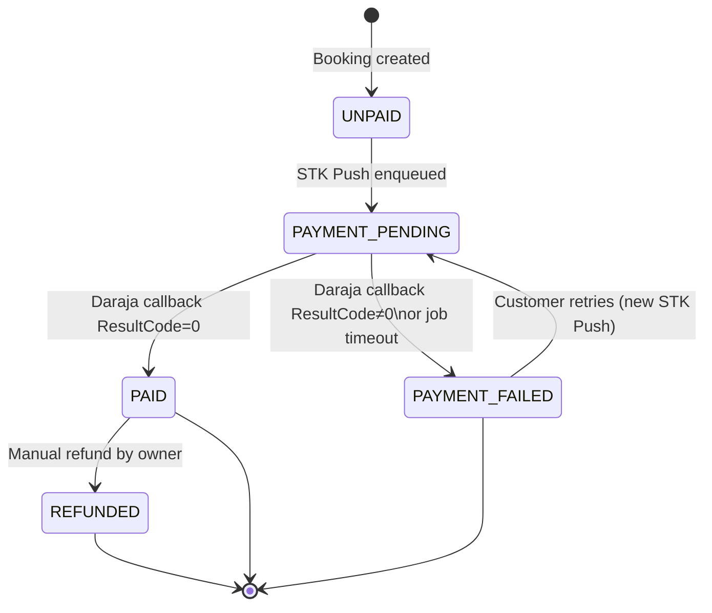
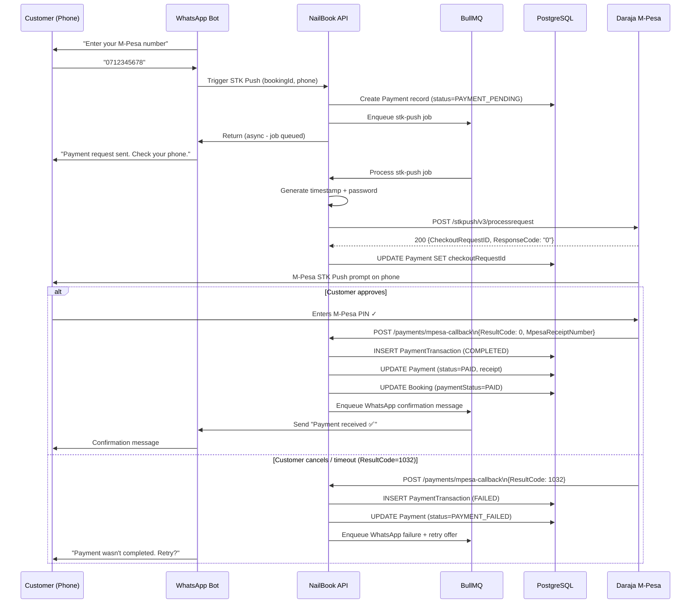

# Payment Workflow — NailBook

**Version:** 1.0  
**Payment Provider:** Safaricom M-Pesa Daraja API v3  
**Transaction Type:** Lipa na M-Pesa (STK Push / CustomerPayBillOnline)

---

## Overview

Payments in Wanny's Nails are initiated via M-Pesa STK Push after a customer confirms their booking in the WhatsApp flow. The customer receives a payment prompt on their phone, enters their M-Pesa PIN, and the result is delivered asynchronously to the backend via a Daraja callback.

All payment initiation is handled asynchronously via BullMQ to avoid blocking the WhatsApp response flow.

---

## Payment State Diagram



---

## M-Pesa STK Push Flow

### Step-by-Step



---

## Daraja API Request Construction

### Password Generation

```typescript
function generateDarajaPassword(shortcode: string, passkey: string): { password: string; timestamp: string } {
  // Timestamp must be in EAT: YYYYMMDDHHMMSS
  const now = utcToZonedTime(new Date(), 'Africa/Nairobi');
  const timestamp = format(now, 'yyyyMMddHHmmss');
  const rawPassword = `${shortcode}${passkey}${timestamp}`;
  const password = Buffer.from(rawPassword).toString('base64');
  return { password, timestamp };
}
```

### STK Push Request

```typescript
interface StkPushRequest {
  BusinessShortCode: string;     // Paybill/Till number
  Password: string;               // Base64(shortcode + passkey + timestamp)
  Timestamp: string;              // YYYYMMDDHHMMSS (EAT)
  TransactionType: 'CustomerPayBillOnline' | 'CustomerBuyGoodsOnline';
  Amount: number;                 // Whole KES, no decimals
  PartyA: string;                 // Customer's phone: 2547XXXXXXXX
  PartyB: string;                 // Same as BusinessShortCode
  PhoneNumber: string;            // Same as PartyA
  CallBackURL: string;            // https://api.nailbook.co.ke/api/v1/payments/mpesa-callback
  AccountReference: string;       // Booking reference: NB-2025-00123 (max 12 chars)
  TransactionDesc: string;        // Max 13 chars: "Nail booking"
}
```

**Phone number normalisation:**

```typescript
function normalisePhone(phone: string): string {
  // Accepts: 0712345678, +254712345678, 254712345678, 0112345678
  // Returns: 254712345678 (Daraja format — no leading +)
  const digits = phone.replace(/\D/g, '');
  if (digits.startsWith('0')) return '254' + digits.slice(1);
  if (digits.startsWith('+254')) return digits.slice(1);
  if (digits.startsWith('254')) return digits;
  throw new ValidationError('INVALID_PHONE', 'Phone number must be a valid Kenyan number');
}
```

---

## Callback Processing

### Callback Endpoint

`POST /api/v1/payments/mpesa-callback`

This endpoint is public (no JWT) but protected by:
1. IP allowlist — only accepts requests from Safaricom's Daraja IP ranges
2. Request body structure validation

### Processing Logic

```typescript
async function processMpesaCallback(body: DarajaCallbackBody) {
  const { stkCallback } = body.Body;
  const { CheckoutRequestID, ResultCode, ResultDesc, CallbackMetadata } = stkCallback;

  // 1. Find the pending payment
  const payment = await prisma.payment.findUnique({
    where: { checkoutRequestId: CheckoutRequestID },
    include: { booking: { include: { customer: true, service: true } } }
  });

  if (!payment) {
    logger.warn({ CheckoutRequestID }, 'Callback for unknown CheckoutRequestID');
    return; // Not our transaction
  }

  // 2. Idempotency check
  if (ResultCode === 0) {
    const receiptNumber = extractMetadata(CallbackMetadata, 'MpesaReceiptNumber');
    const existing = await prisma.paymentTransaction.findUnique({
      where: { mpesaReceiptNumber: receiptNumber }
    });
    if (existing) {
      logger.info({ receiptNumber }, 'Duplicate callback — already processed');
      return;
    }
  }

  // 3. Begin transaction
  await prisma.$transaction(async (tx) => {
    if (ResultCode === 0) {
      const amount = extractMetadata(CallbackMetadata, 'Amount');
      const receiptNumber = extractMetadata(CallbackMetadata, 'MpesaReceiptNumber');
      const transactionDate = extractMetadata(CallbackMetadata, 'TransactionDate');

      // Amount verification
      if (amount !== payment.amountKes) {
        // Flag as disputed, alert owner
        await tx.payment.update({
          where: { id: payment.id },
          data: { status: 'PAYMENT_FAILED', failureReason: `Amount mismatch: expected ${payment.amountKes}, received ${amount}` }
        });
        await alertOwner('PAYMENT_AMOUNT_MISMATCH', payment);
        return;
      }

      // Successful payment
      await tx.paymentTransaction.create({
        data: {
          paymentId: payment.id,
          attemptNumber: await getAttemptNumber(payment.id),
          checkoutRequestId: CheckoutRequestID,
          resultCode: 0,
          resultDesc: ResultDesc,
          mpesaReceiptNumber: receiptNumber,
          rawCallback: body as any,
        }
      });

      await tx.payment.update({
        where: { id: payment.id },
        data: {
          status: 'PAID',
          mpesaReceiptNumber: receiptNumber,
          completedAt: parseDarajaDate(transactionDate),
        }
      });

      await tx.booking.update({
        where: { id: payment.bookingId },
        data: { paymentStatus: 'PAID' }
      });

    } else {
      // Failed payment
      await tx.paymentTransaction.create({
        data: {
          paymentId: payment.id,
          attemptNumber: await getAttemptNumber(payment.id),
          resultCode: ResultCode,
          resultDesc: ResultDesc,
          rawCallback: body as any,
        }
      });

      await tx.payment.update({
        where: { id: payment.id },
        data: { status: 'PAYMENT_FAILED', failureReason: `ResultCode ${ResultCode}: ${ResultDesc}` }
      });
    }
  });

  // 4. Notify customer (outside transaction — non-critical)
  if (ResultCode === 0) {
    await notificationQueue.add('whatsapp-payment-confirmed', {
      phone: payment.booking.customer.phone,
      bookingRef: payment.booking.reference,
      amountKes: payment.amountKes,
    });
  } else {
    await notificationQueue.add('whatsapp-payment-failed', {
      phone: payment.booking.customer.phone,
      resultCode: ResultCode,
      bookingRef: payment.booking.reference,
    });
  }
}
```

---

## M-Pesa Result Codes

| Code | Meaning | Handling |
|---|---|---|
| 0 | Success | Mark PAID |
| 1 | Insufficient funds | Mark FAILED — notify customer to top up |
| 1032 | Request cancelled (timeout or customer cancelled) | Mark FAILED — offer retry |
| 1037 | DS timeout (customer did not respond) | Mark FAILED — offer retry |
| 2001 | Invalid credentials | Mark FAILED — alert sysadmin |
| 17 | Limit exceeded | Mark FAILED — notify customer |
| 26 | System busy | Mark FAILED with retry — re-enqueue STK Push job |

---

## Failure Paths

### Path A: STK Push initiation fails (Daraja returns non-200)

```
Worker dequeues job
→ POST to Daraja fails (4xx/5xx)
→ Worker catches error
→ If attempt < 2: re-enqueue with 30s backoff
→ If attempt 3 exhausted: mark payment PAYMENT_FAILED
→ Notify customer: "We couldn't send the payment request. Please try again."
```

### Path B: Customer doesn't respond to STK Push (ResultCode 1032/1037)

```
Daraja callback arrives (ResultCode 1032)
→ Mark PaymentTransaction FAILED
→ Mark Payment PAYMENT_FAILED
→ Notify customer via WhatsApp:
  "It looks like the payment wasn't completed.
   Would you like to try again?
   1. Retry payment
   2. Cancel booking"
```

### Path C: Callback never arrives

```
Background job runs every 15 minutes
→ Queries payments in PAYMENT_PENDING older than 30 minutes
→ For each stale payment: query Daraja /stkpush/v3/query endpoint
→ If Daraja confirms failure: mark PAYMENT_FAILED
→ If Daraja confirms success but we missed callback: process as success
→ Notify customer accordingly
```

---

## Retry Path

When a customer chooses to retry payment (via WhatsApp ):

```
1. Verify booking is still APPROVED
2. Create a new STK Push job
3. Update Payment: status = PAYMENT_PENDING, checkoutRequestId = null (pending new one)
4. Proceed as normal STK Push flow
```

Each retry creates a new `PaymentTransaction` record with an incremented `attemptNumber`.

---

## Reconciliation Strategy

### Daily Reconciliation Job

Runs at 23:00 EAT daily:

1. Query all payments with status PAYMENT_PENDING created before today
2. For each: call Daraja `/stkpush/v3/query` to get current status
3. Reconcile discrepancies (mark as PAID if Daraja shows success, FAILED otherwise)
4. Log all discrepancies to audit log
5. Alert owner of any reconciliation anomalies

### Manual Reconciliation

Owner can mark a booking as manually paid from the PWA app (for cash payments):

```
POST /bookings/:id/mark-paid
{
  "method": "CASH",
  "notes": "Customer paid in salon"
}
```

This creates a Payment record with `status=PAID` and `mpesaReceiptNumber=null`.
