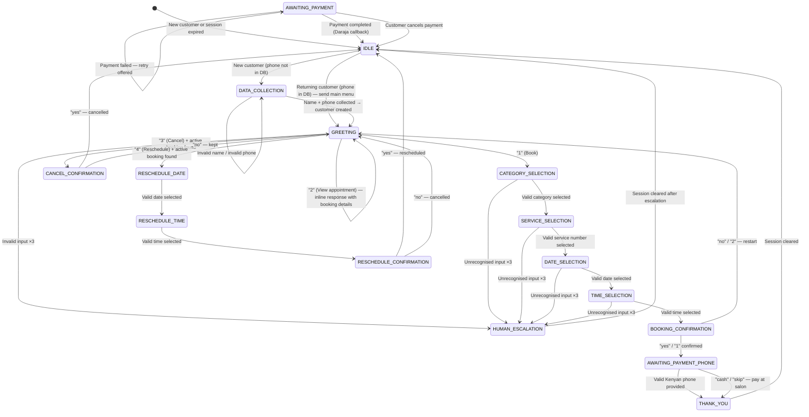

# WhatsApp Automation — Wanny's Nails

**Version:** 1.2

---

## Overview

The WhatsApp chatbot uses a **deterministic FSM architecture** that handles structured booking flows with strict validation at every boundary. Invalid input is managed through an escalation ladder that transitions to human support after repeated failures.

**Key Principles:**
- Deterministic: Booking flows behave identically every time
- Zero cost per message for the structured majority
- Fail-fast validation at every system boundary
- Transactional state transitions (only commit state after successful outbound delivery)
- Idempotent message processing via `wamid` deduplication

---

## WhatsApp Cloud API Integration Flow

```
Facebook Account
   |
   |__Meta App
   |    |__Webhooks-------------------- Step 2
   |
   |__Business Portfolio
        |_Test WhatsApp Business     --- Step 1
        | account (WABA)
        |_Your WhatsApp Business account (WABA)
             |__Phone Number --------------- Step 2
             |__Message Templates ---------- Step 2
             |__Payment Method ------------- Step 2
             |
             |__System User ------------------- Step 2
             |__Business Verification ---------- Step 3
```

**Escalation Ladder:**

```
FSM handles it          (structured flow — free, instant, deterministic)
        │
        │ unrecognised input ×3  OR  intent outside FSM scope
        ▼

HUMAN_ESCALATION        (owner notified via Web Push / WhatsApp)
```

---

## Conversation Architecture

```
Incoming WhatsApp message
         │
         ▼
POST /webhooks/whatsapp
         │
         ▼
Inbound Validation Middleware (Zod schemas)
         │
         ▼
WAMID Deduplication (Redis, 5-min TTL)
         │
         ▼
Async Queue (immediate 200 OK to WhatsApp)
         │
         ▼
Global Intent Check (STOP / human / menu keywords)
         │
         ▼
FSM Engine.processMessage()
         │
         ├── Load session from Redis (or create new, TTL 30 min)
         │
         ├── State-Aware Input Validation (Zod schema per state)
         │
         ├── Execute State Handler
         │
         ├── Transactional Outbound:
         │   ├── Generate messages
         │   ├── Validate messages (Zod)
         │   ├── Send via WhatsApp Transport Service
         │   └── On success: commit state transition
         │       On failure: stay in current state
         │
         └── Save updated session to Redis
```

---

## Validation Architecture

### Inbound Validation

Every incoming webhook payload is validated before entering the FSM:

```
Webhook Payload
   │
   ▼
Validate webhook structure
   │
   ▼
Validate event type
   │
   ▼
Normalize to InboundNormalizedEvent
   │
   ▼
FSM Engine
```

**Validation Responsibilities:**
- Validate webhook payload structure
- Validate supported event types (`messages` only)
- Validate text messages (non-empty, max length)
- Validate interactive replies (button/list)
- Normalize payloads into internal format
- Reject malformed payloads immediately

**Boundary:** No business logic executes before validation succeeds.

### State-Aware Input Validation

Each FSM state defines its input schema. Validation occurs **after** loading the session but **before** executing the state handler:

```
Load Session
   │
   ▼
Get State Input Schema
   │
   ▼
Validate Incoming Message
   │
   ├── Success → Execute State Handler
   │
   └── Failure
        ├── Increment invalidInputCount
        ├── Return validation failure response
        ├── Log validation error
        └── Preserve current state (no transition)
```

**Examples:**

| State | Input Schema |
|-------|-------------|
| `DATA_COLLECTION` (NAME phase) | `string().min(5, "Name must be at least 5 characters")` |
| `DATA_COLLECTION` (PHONE phase) | `PhoneNumberSchema` (E.164 Kenyan format) |
| `SERVICE_SELECTION` | `string().regex(/^\d+$/)` + range check |
| `DATE_SELECTION` | `z.coerce.number()` + availability check |
| `TIME_SELECTION` | `z.coerce.number()` + slot availability check |
| `BOOKING_CONFIRMATION` | `z.enum(["yes", "y", "1", "no", "n", "2"])` |
| `AWAITING_PAYMENT_PHONE` | `PhoneNumberSchema` |

### Outbound Validation

Every outbound message is validated before contacting WhatsApp:

```
Generate Message
   │
   ▼
Zod Validation (OutboundMessageSchema)
   │
   ├── Success → Transport Service → WhatsApp API
   │
   └── Failure
        ├── Throw validation error
        ├── Do not send request
        ├── Stay in current state
        └── Log invalid payload
```

**Validation Contract:**
- Text: `body` max 4096 chars
- Interactive header: max 60 chars
- Interactive list rows: max 10 per section, max 10 sections
- Interactive list row title: max 24 chars
- Interactive list row description: max 72 chars
- Button title: max 20 chars
- Button count: max 3

### Transactional State Changes

State transitions are **not committed until outbound delivery succeeds**:

```
Current State
   │
   ▼
Generate Message(s)
   │
   ▼
Validate Message(s)
   │
   ▼
Send via Transport Service
   │
   ▼
Accepted by WhatsApp?
   │
   ├── Yes → Commit State Transition → Save Session
   │
   └── No
        ├── Stay in Current State
        ├── Log transport error
        └── Return typed error to FSM
```

This prevents state corruption from partial failures.

### WhatsApp Transport Service

A dedicated transport service owns all outbound communication:

**Responsibilities:**
- Validate outbound payloads (Zod)
- Serialize payloads to WhatsApp format
- Send HTTP requests to WhatsApp Cloud API
- Handle transport errors (network, 5xx)
- Handle WhatsApp API errors (4xx, rate limits, invalid numbers)
- Implement retries with exponential backoff
- Log request/response metadata + correlation IDs
- Return typed results (`SendMessageResult`)

**Boundary:** No other module in the conversation worker calls WhatsApp Cloud API directly.

### Typed Result Pattern

Validation and transport failures return typed results instead of throwing exceptions:

**Success:**
```typescript
{
  ok: true,
  messageId: "wamid:ABC123",
  status: 200
}
```

**Validation Failure:**
```typescript
{
  ok: false,
  type: "VALIDATION_ERROR",
  errors: z.ZodError
}
```

**Transport Failure (Network/5xx):**
```typescript
{
  ok: false,
  type: "TRANSPORT_ERROR",
  status: 500,
  retryable: true
}
```

**WhatsApp API Failure:**
```typescript
{
  ok: false,
  type: "WHATSAPP_ERROR",
  status: 400,
  code: 131047,      // Unsupported message type
  message: "...",
  retryable: false
}
```

### Logging Strategy

**Validation Logs** (separate from transport logs):
- Conversation ID (phone)
- Current FSM state
- Validation errors
- Invalid payload (truncated)

**Transport Logs**:
- Request payload
- Response status
- WhatsApp error body
- Retry attempts
- Correlation IDs

---

## Session Structure (Redis)

**Key:** `session:{e164Phone}` (e.g., `session:+254712345678`)
**TTL:** 1800 seconds (30 minutes, reset on each message)
**Format:** JSON

```typescript
interface ConversationSession {
  state: ConversationState;
  customerId?: string;
  customerName?: string;
  selectedService?: {
    id: string;
    name: string;
    durationMinutes: number;
    priceKes: number;
  };
  selectedDate?: string; // "YYYY-MM-DD" (EAT)
  selectedTime?: string; // "HH:MM" (EAT)
  appointmentAt?: string; // ISO UTC (computed after date+time selected)
  bookingId?: string;
  bookingRef?: string;
  paymentPhone?: string;
  /** Selected service category filter — set during CATEGORY_SELECTION */
  selectedCategory?: ServiceCategory;
  /** Sub-phase within DATA_COLLECTION: "NAME" (collecting name) or "PHONE" (collecting phone) */
  collectionPhase?: "NAME" | "PHONE";
  /** Temp name stored during DATA_COLLECTION before DB record is created */
  temporaryName?: string;
  invalidInputCount: number; // Increments on bad input; escalate at 3
  lastActivity: string; // ISO UTC
  flow?: "BOOKING" | "RESCHEDULE" | "CANCEL" | "LOOKUP";
}
```

---

## State Machine

### States

```typescript
type ConversationState =
  | "IDLE"
  | "GREETING"
  | "DATA_COLLECTION"
  | "CATEGORY_SELECTION"
  | "SERVICE_SELECTION"
  | "DATE_SELECTION"
  | "TIME_SELECTION"
  | "BOOKING_CONFIRMATION"
  | "AWAITING_PAYMENT_PHONE"
  | "AWAITING_PAYMENT"
  | "THANK_YOU"
  | "RESCHEDULE_DATE"
  | "RESCHEDULE_TIME"
  | "RESCHEDULE_CONFIRMATION"
  | "CANCEL_CONFIRMATION"
  | "HUMAN_ESCALATION";
```

### State Transition Diagram



---

## State Handler Specifications

### State: IDLE / Session Expired

**Entry Condition:** No existing session or TTL expired (`loadSession` returns `null`).

**Purpose:** Determine if customer is new or returning, and route accordingly.

**Flow:**

1. **Check DB:** Look up customer by phone number via `getByPhone()`
2. **If found (returning customer):**
   - Set session `customerId`, `customerName`
   - Transition → `GREETING`
   - Engine sends main menu interactive list
3. **If not found (new customer):**
   - Transition → `DATA_COLLECTION`
   - Engine sends entry prompt: "Hi! Welcome to Wanny's Nails! 👋\n\nWe'd love to get to know you better.\nWhat's your name?"
   - Set `collectionPhase: "NAME"`

**Input:** Any message (used for global intent detection only — STOP/HUMAN/MENU)

**Session Updates:** None (session is empty on entry)

**Transition:** `GREETING` or `DATA_COLLECTION` (determined by DB lookup)

**Notes:** The engine's entry-prompt logic (step 8b) sends the DATA_COLLECTION entry prompt when transitioning from IDLE to DATA_COLLECTION.

---

### State: DATA_COLLECTION

**Entry Condition:** IDLE handler detected a new customer (phone not in DB). `session.collectionPhase` is set to `"NAME"`.

**Purpose:** Collect the new customer's name and phone number before creating their DB record and entering the main menu.

**Message Type:** Text (free-text input required)

**Sub-phases:** Tracked via `session.collectionPhase`:

#### Phase: NAME

**Bot message (on entry):**
```
Hi! Welcome to Wanny's Nails! 👋

We'd love to get to know you better.
What's your name?
```

**Validation:** Name must be ≥ 5 characters.

**Transitions:**

| Input | Transition |
|-------|------------|
| Name ≥ 5 chars | Save to `temporaryName`, set phase → PHONE, ask for phone number |
| < 5 chars or empty | Stay in NAME, show error message |

#### Phase: PHONE

**Bot message:**
```
Nice to meet you, [Name]! 😊

Could you share your WhatsApp phone number for automated reminders?
(e.g., 0712 345 678)
```

**Validation:** Must be valid Kenyan phone number (E.164 format: `254XXXXXXXXX`).

**Transitions:**

| Input | Transition |
|-------|------------|
| Valid Kenyan phone after normalization | Create customer in DB (name + phone), set `customerId` + `customerName` → GREETING |
| Invalid format | Stay in PHONE, show error message |

**On validation failure:** Increment `invalidInputCount`. If count reaches 3, transition → `HUMAN_ESCALATION`.

**On DB creation failure:** Log error and proceed to GREETING with collected name as fallback.

---

### State: GREETING

**Message Type:** 📋 Interactive List

**Bot message:**

```
Header:
Wanny's Nails 💅

Body:
Hi [name]! 👋 Welcome to Wanny's Nails.
How can we help you today?

Button:
Choose an option

Section: Appointments

┌──────────────────────────────────────────┐
│ Row 1: Book Appointment                  │
│         Schedule a new appointment       │
├──────────────────────────────────────────┤
│ Row 2: View Appointment                  │
│         Check your upcoming appointment  │
├──────────────────────────────────────────┤
│ Row 3: Reschedule                        │
│         Change your appointment date/time│
├──────────────────────────────────────────┤
│ Row 4: Cancel                            │
│         Cancel an existing appointment   │
└──────────────────────────────────────────┘
```

(If new/unknown customer, use "Hi there!")

**Transitions:**

| Input (list row id / text) | Transition | Notes |
| -------------------------- | ---------- | ----- |
| `"1"` / `"book"` | → `CATEGORY_SELECTION` | |
| `"2"` / `"view"` | Stay in `GREETING` | Inline response with booking details text + action buttons |
| `"3"` / `"cancel"` | → `CANCEL_CONFIRMATION` | Requires active booking; else show "No active booking" |
| `"4"` / `"reschedule"` | → `RESCHEDULE_DATE` | Requires active booking; else show "No active booking" |
| Anything else | Stay in `GREETING`, increment `invalidInputCount` | Resend menu |

**View Appointment Response:**

When customer views an appointment, two messages are sent inline (no state change):

1. **Text message** showing booking details
2. **Interactive button** with actions:

```
Body: What would you like to do?
Button: Manage booking

┌─────────────┐ ┌─────────────┐
│   Cancel    │ │  Reschedule │
└─────────────┘ └─────────────┘
```

| Button ID | Action |
| --------- | ------ |
| `"3"` | Transition to `CANCEL_CONFIRMATION` |
| `"4"` | Transition to `RESCHEDULE_DATE` |

---

### State: CATEGORY_SELECTION

**Message Type:** 📋 Interactive List

**Purpose:** Let the customer filter services by category before seeing individual services.

**Bot message:**

```
Header:
Choose Category

Body:
What type of service are you looking for?

Button:
Choose a category

Section: Categories

┌──────────────────────────────────────────┐
│ Manicure                                │
├──────────────────────────────────────────┤
│ Pedicure                                │
├──────────────────────────────────────────┤
│ Enhancements                            │
├──────────────────────────────────────────┤
│ Nail Art                                │
├──────────────────────────────────────────┤
│ Extensions                              │
└──────────────────────────────────────────┘
```

**Transitions:**

| Input (list row id) | Transition |
| ------------------- | ----------- |
| Valid category (1–N) | Save to `selectedCategory` → `SERVICE_SELECTION` |
| Invalid | Increment `invalidInputCount`, resend list |

---

### State: SERVICE_SELECTION

**Message Type:** 📋 Interactive List

**Bot message:**

```
Header:
Our Services

Body:
Which service would you like?

Button:
Choose a service

Section: [Selected Category]

┌──────────────────────────────────────────┐
│ Gel Manicure                             │
│ KES 1,500 — 60 min                      │
├──────────────────────────────────────────┤
│ Acrylic Set                              │
│ KES 2,500 — 90 min                      │
├──────────────────────────────────────────┤
│ Nail Art                                 │
│ KES 2,000 — 75 min                      │
└──────────────────────────────────────────┘
```

Services are filtered by `selectedCategory` and only `isActive=true` services are shown, ordered by `sortOrder`.

**Transitions:**

| Input (list row id) | Transition |
| ------------------- | ----------- |
| Valid number (1–N) | Save service to `selectedService` → `DATE_SELECTION` |
| Invalid | Increment `invalidInputCount`, resend list |

---

### State: DATE_SELECTION

**Message Type:** 📋 Interactive List

**Bot message:**

```
Header:
Pick a Date

Body:
When would you like your [Service Name]?

Button:
Choose a date

Section: Available Dates

┌──────────────────────────────────────────┐
│ Today (Thu 5 Jun)                        │
│ Available                                │
├──────────────────────────────────────────┤
│ Fri 6 Jun                                │
│ Available                                │
├──────────────────────────────────────────┤
│ Sat 7 Jun                                │
│ Available                                │
├──────────────────────────────────────────┤
│ Mon 9 Jun                                │
│ Available                                │
├──────────────────────────────────────────┤
│ Tue 10 Jun                               │
│ (Full — no description shown)            │
└──────────────────────────────────────────┘
```

Presents the next 7 business days with available slots. Fully booked days appear without a description (not selectable). Closed days are omitted.

**Slot count** is fetched from the availability engine.

**Transitions:**

| Input (list row id) | Transition |
| ------------------- | ----------- |
| Valid number for available date | Save to `selectedDate` → `TIME_SELECTION` |
| Number for full date | "That day is fully booked. Please choose another." — stay in DATE_SELECTION |
| Invalid | Increment `invalidInputCount`, resend list |

---

### State: TIME_SELECTION

**Message Type:** 📋 Interactive List

**Bot message:**

```
Header:
Pick a Time

Body:
Available times for [Service] on [Date]:

Button:
Choose a time

Section: Available Times

┌──────────────────────────────────────────┐
│ 10:00 AM                                 │
├──────────────────────────────────────────┤
│ 11:30 AM                                 │
├──────────────────────────────────────────┤
│ 2:00 PM                                  │
├──────────────────────────────────────────┤
│ 3:30 PM                                  │
└──────────────────────────────────────────┘
```

**Transitions:**

| Input (list row id) | Transition |
| ------------------- | ----------- |
| Valid number | Save to `selectedTime`, compute `appointmentAt` → `BOOKING_CONFIRMATION` |
| Invalid | Increment `invalidInputCount`, resend list |

---

### State: BOOKING_CONFIRMATION

**Message Type:** Text summary + 🔘 Interactive Buttons

**Bot messages:**

Message 1 (text):

```
Please confirm your booking:

✂️ Service: Gel Manicure
📅 Date: Thursday, 5 June 2025
⏰ Time: 2:00 PM
💰 Price: KES 1,500
```

Message 2 (interactive button):

```
Body: Does everything look good?
Button: Confirm booking

┌──────────────────┐ ┌──────────────────┐
│  Yes, Confirm    │ │ No, Start Over   │
└──────────────────┘ └──────────────────┘
```

**Transitions:**

| Input (button id) | Transition | Action |
| ----------------- | ---------- | ------ |
| `"yes"` / `"y"` / `"1"` | → `AWAITING_PAYMENT_PHONE` | Create PENDING booking in DB |
| `"no"` / `"n"` / `"2"` | → `GREETING` | Clear session context |

---

### State: AWAITING_PAYMENT_PHONE

**Message Type:** Text (free-text input for phone number)

**Bot message:**

```
Your booking has been received! 🎉
Reference: NB-2025-00123

To complete your booking, please tell me:

If paying via 📱 M-Pesa — What number should we send the payment request to?
(e.g., 0712 345 678)

If paying with 💵 cash — Just reply 'cash' and you can pay at the salon.
```

**Validation:** Must be valid Kenyan phone number (E.164 format) OR cash/skip keyword.

**Transitions:**

| Input | Transition | Action |
| ----- | ---------- | ------ |
| Valid Kenyan phone | → `THANK_YOU` | Save to `paymentPhone`, approve booking |
| "cash" / "skip" / "no" / "pay at salon" | → `THANK_YOU` | Approve booking, no phone saved |
| Invalid | Stay in `AWAITING_PAYMENT_PHONE` | Increment `invalidInputCount`, show error |

If `invalidInputCount >= 3` → `HUMAN_ESCALATION`.

---

### State: THANK_YOU

**Message Type:** Text

**Bot message (M-Pesa):**

```
Thank you for booking with Wanny's Nails! 🎉💅

📋 Reference: NB-2025-00123
✂️ Service: Gel Manicure
📅 Thursday, 5 June 2025
⏰ 2:00 PM
💰 KES 1,500

We'll send the M-Pesa payment request to 0712345678.

We'll send you a reminder 24 hours before your appointment. See you soon! 😊
```

**Bot message (Cash):**

```
Thank you for booking with Wanny's Nails! 🎉💅

📋 Reference: NB-2025-00123
✂️ Service: Gel Manicure
📅 Thursday, 5 June 2025
⏰ 2:00 PM
💰 KES 1,500

Please pay at the salon when you arrive.

We'll send you a reminder 24 hours before your appointment. See you soon! 😊
```

**Transitions:**

| Input | Transition | Action |
| ----- | ---------- | ------ |
| Any | → `IDLE` | Clear session data |

---

### State: AWAITING_PAYMENT

**Bot message (on entry):**

```
We've sent an M-Pesa payment request of KES 1,500 to 0712345678.
Please check your phone and enter your M-Pesa PIN to confirm. 📲

This request will expire in 5 minutes.
```

This state is **asynchronously exited** — the FSM does not block waiting. The Daraja callback triggers the next step via the payment callback processor.

**When customer replies while in AWAITING_PAYMENT:**

| Input | Transition | Action |
| ----- | ---------- | ------ |
| `"1"` / `"retry"` | Stay in `AWAITING_PAYMENT` | Enqueue new STK Push |
| `"2"` / `"cancel"` | → `GREETING` | Cancel PENDING booking, clear session flow |
| Anything else | Stay in `AWAITING_PAYMENT` | Remind about pending payment, show action buttons |

**On any other input while waiting:** Remind the customer about the pending payment and show the same action buttons.

**When payment succeeds (triggered by Daraja callback):**

```
Payment received! ✅

📋 Booking: NB-2025-00123
✂️ Service: Gel Manicure
📅 Thursday, 5 June 2025
⏰ 2:00 PM
📍 Wanny's Nails, Nairobi

We'll send you a reminder 24 hours before. See you then! 💅
```

Session cleared → `IDLE`

**When payment fails (triggered by Daraja callback):**

Message 1 (text):

```
The payment wasn't completed.
```

Message 2 (interactive button):

```
Body: What would you like to do?
Button: Choose an option

┌─────────────┐ ┌───────────────────┐
│  Try Again  │ │  Cancel Booking   │
└─────────────┘ └───────────────────┘
```

---

### State: CANCEL_CONFIRMATION

**Message Type:** Text summary + 🔘 Interactive Buttons

**Bot messages:**

Message 1 (text):

```
Are you sure you want to cancel your appointment?

✂️ Gel Manicure
📅 Thursday, 5 June at 2:00 PM
```

Message 2 (interactive button):

```
Body: Please confirm:
Button: Cancel appointment

┌────────────────┐ ┌────────────────┐
│  Yes, Cancel   │ │  No, Keep It   │
└────────────────┘ └────────────────┘
```

**Transitions:**

| Input | Transition | Action |
| ----- | ---------- | ------ |
| `"1"` / `"yes"` | → `GREETING` | Cancel booking in DB, send confirmation |
| `"2"` / `"no"` | → `GREETING` | "Your appointment is still on!" |

---

### State: RESCHEDULE_DATE

**Message Type:** 📋 Interactive List

Presents available dates for rescheduling, identical format to `DATE_SELECTION` but with the header "Pick a New Date" and button text "Choose a date".

**Transitions:**

| Input (list row id) | Transition |
| ------------------- | ----------- |
| Valid number for available date | Save to `selectedDate` → `RESCHEDULE_TIME` |
| Number for full date | "That day is fully booked. Please choose another." — stay in RESCHEDULE_DATE |
| Invalid | Increment `invalidInputCount`, resend list |

---

### State: RESCHEDULE_TIME

**Message Type:** 📋 Interactive List

Presents available times for the selected reschedule date, with header "Pick a New Time" and button text "Choose a time".

**Transitions:**

| Input (list row id) | Transition |
| ------------------- | ----------- |
| Valid number | Save to `selectedTime`, update `appointmentAt` → `RESCHEDULE_CONFIRMATION` |
| Invalid | Increment `invalidInputCount`, resend list |

---

### State: RESCHEDULE_CONFIRMATION

**Message Type:** Text summary + 🔘 Interactive Buttons

**Bot messages:**

Message 1 (text):

```
Please confirm your new appointment time:

✂️ Service: Gel Manicure
📅 Date: Thursday, 12 June 2025
⏰ Time: 3:00 PM
```

Message 2 (interactive button):

```
Body: Does everything look good?
Button: Confirm reschedule

┌────────────────────┐ ┌────────────────┐
│ Yes, Reschedule    │ │   No, Cancel   │
└────────────────────┘ └────────────────┘
```

**Transitions:**

| Input | Transition | Action |
| ----- | ---------- | ------ |
| `"yes"` / `"y"` / `"1"` | → `GREETING` | Reschedule booking in DB, send confirmation |
| `"no"` / `"n"` / `"2"` | → `GREETING` | "Reschedule cancelled. Your original appointment remains unchanged." |

---

### State: HUMAN_ESCALATION

**Triggered by:**

1. Customer sends "human" / "agent" / "help me" / "talk to someone" from any state
2. `invalidInputCount` reaches 3 in any FSM state

**Note:** There is no AI fallback state. Invalid input escalates directly to human support.

**Bot message:**

```
I'm going to connect you with our team right away.
Please wait a moment — someone will be with you shortly.

You can also call us on +254 700 000 000.
```

**System Action:**

1. Enqueue a notification job that sends a **Web Push notification** to the owner's installed PWA
2. If Web Push permission not granted or PWA not installed: fall back to a WhatsApp message to the owner's personal number
3. Notification payload:

```json
{
  "title": "Customer needs help — Wanny's Nails",
  "body": "{{customerName}} ({{phone}}) needs assistance.",
  "data": {
    "url": "/customers/{{customerId}}",
    "customerPhone": "{{phone}}",
    "conversationSummary": "{{lastFewMessages}}"
  }
}
```

4. Clicking the notification opens the PWA directly to the customer's profile
5. Session cleared → `IDLE`. Owner responds via their personal WhatsApp directly to the customer.

---

## Interactive Message Summary by State

| State | Message Type | Details |
| ----- | ----------- | ------- |
| **IDLE → GREETING** | 📋 Interactive list | Main menu with 4 options |
| **IDLE → DATA_COLLECTION** | Text | Name prompt |
| **DATA_COLLECTION** | Text | Free-text input for name and phone |
| **GREETING** (menu) | 📋 Interactive list | Main menu re-displayed on invalid input |
| **GREETING** (view) | Text + 🔘 Buttons | Booking details text, then Cancel/Reschedule buttons |
| **CATEGORY_SELECTION** | 📋 Interactive list | Service category options |
| **SERVICE_SELECTION** | 📋 Interactive list | Service options with price, duration, category-filtered |
| **DATE_SELECTION** | 📋 Interactive list | Available dates with slot info |
| **TIME_SELECTION** | 📋 Interactive list | Available time slots for selected date |
| **BOOKING_CONFIRMATION** | Text + 🔘 Buttons | Summary text, then Yes, Confirm / No, Start Over |
| **AWAITING_PAYMENT_PHONE** | Text | Free-text input for M-Pesa phone number |
| **AWAITING_PAYMENT** | Text + 🔘 Buttons | Payment status, then Resend Request / Cancel Booking |
| **CANCEL_CONFIRMATION** | Text + 🔘 Buttons | Summary text, then Yes, Cancel / No, Keep It |
| **RESCHEDULE_DATE** | 📋 Interactive list | Available dates for rescheduling |
| **RESCHEDULE_TIME** | 📋 Interactive list | Available times for rescheduling |
| **RESCHEDULE_CONFIRMATION** | Text + 🔘 Buttons | Summary text, then Yes, Reschedule / No, Cancel |
| **HUMAN_ESCALATION** | Text | Escalation notice to customer |
| **Payment callback (success)** | Text | Confirmation details |
| **Payment callback (fail)** | Text + 🔘 Buttons | Error text, then Try Again / Cancel Booking |

---

## Timeout Handling

Redis TTL automatically expires sessions after 30 minutes of inactivity. When an expired customer sends a new message, the system detects the absence of a session and starts fresh.

**On session expiry + new message:**

```
Your previous session expired due to inactivity.
Let's start fresh! 😊

[Sends GREETING interactive list menu]
```

---

## Invalid Input Handling

Every state increments `invalidInputCount` on an unrecognised input.

- Counts 1–2: Resend the interactive menu/options with the appropriate message type
- Count 3: Transition to `HUMAN_ESCALATION` — the customer is connected to the salon team

The counter resets to 0 on any successful state transition or global intent match (STOP/HUMAN/MENU).

---

## Global Intent Detection

Before processing a message with the current state's handler, the FSM checks for global intents that override the current flow:

| Keyword | Action |
| ------- | ------ |
| "stop", "STOP", "unsubscribe" | Opt out of all messaging. Log consent withdrawal. Send farewell message. Session deleted → IDLE. |
| "human", "agent", "help me", "talk to someone" | → `HUMAN_ESCALATION` (skip to human immediately, customer explicitly wants a person) |
| "menu", "start" (in non-IDLE states) | → `GREETING` (restart flow — resets `invalidInputCount`, clears flow data, sends interactive list) |
| Unrecognised in any FSM state ×3 | → `HUMAN_ESCALATION` |

Note: Global intent keywords also work when the customer types them instead of tapping interactive elements, providing a text-based escape hatch at any point.

---

## Validation Pipeline Architecture

### Inbound Validation

```
InboundMessage
   │
   ▼
validateInboundMessage()
   │
   ├── WebhookPayloadSchema validation
   │   └── Ensure required fields: object, entry, changes
   │
   ├── Event type validation (messages only)
   │   └── Reject unsupported event types
   │
   ├── Message type normalization
   │   ├── Text messages → extract body
   │   ├── Interactive replies → extract button/list_reply.id
   │   └── Error message on unsupported type
   │
   └── InboundNormalizedEvent
```

### Outbound Validation

```
OutboundMessage
   │
   ▼
WhatsAppTextMessageSchema / WhatsAppInteractiveMessageSchema
   │
   ├── Type field validation
   ├── Body/header text length checks
   ├── List section/row limits (10 max each)
   ├── Button count limits (3 max)
   └── Button title length (max 20 chars)
```

### State-Aware Input Validation

Each state maps to a Zod schema:

```typescript
const STATE_INPUT_SCHEMAS: Partial<Record<ConversationState, z.ZodType>> = {
  GREETING: z.enum(["1", "2", "3", "4", "book", "view", "cancel", "reschedule"]),
  CATEGORY_SELECTION: z.coerce.number().min(1), // min checked against actual DB count
  SERVICE_SELECTION: z.coerce.number().min(1),
  DATE_SELECTION: z.coerce.number().min(1),
  TIME_SELECTION: z.coerce.number().min(1),
  BOOKING_CONFIRMATION: z.enum(["yes", "y", "1", "no", "n", "2"]),
  AWAITING_PAYMENT_PHONE: KenyanPhoneSchema,
  AWAITING_PAYMENT: z.enum(["1", "retry", "2", "cancel"]),
  CANCEL_CONFIRMATION: z.enum(["yes", "y", "1", "no", "n", "2"]),
  RESCHEDULE_DATE: z.coerce.number().min(1),
  RESCHEDULE_TIME: z.coerce.number().min(1),
  RESCHEDULE_CONFIRMATION: z.enum(["yes", "y", "1", "no", "n", "2"]),
  DATA_COLLECTION: z.string(), // Sub-schema determined by collectionPhase
};
```

Validation occurs in `engine.ts`:
```typescript
// 1. Get schema for current state
const inputSchema = STATE_INPUT_SCHEMAS[session.state];

// 2. Validate if schema exists
if (inputSchema) {
  const result = inputSchema.safeParse(message);
  if (!result.success) {
    incrementInvalidCount(session);
    // Return validation failure response (no state transition)
    return;
  }
}

// 3. Execute state handler with validated input
```

---

## WhatsApp Message Templates

Templates must be approved by Meta before use. Used for outbound messages outside the 24-hour conversation window.

### Template: `appointment_reminder_24h`

```
Hello {{1}}! 👋

This is a reminder about your appointment tomorrow:

✂️ {{2}}
📅 {{3}}
⏰ {{4}}
📍 Wanny's Nails, Nairobi

Reply "reschedule" or "cancel" if your plans change.
See you soon! 💅
```

Variables: `[customerName, serviceName, date, time]`

### Template: `appointment_reminder_1h`

```
Hi {{1}}! Your appointment is in 1 hour.

✂️ {{2}} at {{3}}
📍 Wanny's Nails, Nairobi

See you soon! 💅
```

### Template: `booking_confirmed`

```
Your appointment has been confirmed! ✅

📋 Ref: {{1}}
✂️ {{2}}
📅 {{3}} at {{4}}
📍 Wanny's Nails, Nairobi

See you then! 💅
```

### Template: `booking_cancelled`

```
Your appointment has been cancelled.

✂️ {{1}} on {{2}}

We hope to see you again soon. Book a new appointment anytime by messaging us here.
```

---

## Outbound Message Types (Zod Schemas)

The `OutboundMessage` type is validated against these schemas before sending:

### Text Message Schema

```typescript
{
  type: "text",
  text: string, // min 1 char, max 4096 chars
  preview_url?: boolean // default false
}
```

### Interactive List Message Schema

```typescript
{
  type: "interactive_list",
  text: string, // min 1 char, max 4096 chars
  listTitle: string, // min 1 char, max 60 chars
  listButtonText: string, // min 1 char, max 20 chars
  listSections: [
    {
      title?: string, // max 24 chars
      rows: [
        {
          id: string, // min 1 char, max 200 chars
          title: string, // min 1 char, max 24 chars
          description?: string // max 72 chars
        }
      ] // min 1 row, max 10 rows
    }
  ] // min 1 section, max 10 sections
}
```

**WhatsApp Limits:**
- Max 10 rows per section
- Max 10 sections total
- Max 250 total rows across all sections

### Interactive Button Message Schema

```typescript
{
  type: "interactive_button",
  text: string, // min 1 char, max 4096 chars
  buttonTitle?: string, // metadata field
  buttons: [
    {
      id: string, // machine-readable ID
      title: string  // min 1 char, max 20 chars, text only
    }
  ] // min 1 button, max 3 buttons
}
```

---

## Webhook Delivery Reliability

WhatsApp Cloud API guarantees at-least-once delivery. The FSM is designed to be idempotent:

- **Message ID Deduplication:** `wamid` values are stored in Redis with a 5-minute TTL
- **Deduplication Check:** If a message with the same `wamid` is received twice, the second is discarded
- This prevents duplicate state transitions from WhatsApp retries

```typescript
// In inbound validation middleware
const key = `wamid:${wamid}`;
const exists = await redis.get(key);
if (exists) {
  log.warn({ wamid }, "Duplicate message — discarding");
  return; // Skip processing
}
await redis.setex(key, 300, "1"); // 5 min TTL
```

---

## Rate Limiting

WhatsApp Cloud API has per-phone rate limits:

- Max 1 message per second per recipient
- The transport service respects this with a per-phone token bucket (Redis-based)
- If rate limited (429): message is re-enqueued with a 2-second delay
- Maximum retry attempts: 3

---

## Environment Variables

### Required

```bash
# WhatsApp Cloud API
WHATSAPP_PHONE_NUMBER_ID=1234567890
WHATSAPP_ACCESS_TOKEN=EAAJ...
```

### Optional (for validation pipeline)

No additional environment variables needed. Zod validation introduces zero runtime overhead when validation passes.

---

## Implementation Notes

### Validation Boundaries

Validation occurs at **every boundary**:

1. **Inbound Webhook** → `validateInboundMessage()`
2. **State Handler Input** → `validateInputForState()`
3. **Outbound Messages** → `OutboundMessageSchema`
4. **Transport Payload** → WhatsApp API schema validation

### Transactional Guarantees

State transitions follow this protocol:

```
1. Save original state
2. Execute state handler (may fail validation)
3. Generate outbound messages
4. Validate outbound messages (Zod)
5. Send via transport service (async)
6. On success: commit state transition + save session
7. On validation/transport failure: stay in original state, log error
```

### Idempotency

- Session updates are atomic (single `SETEX` after all messages sent)
- WAMID deduplication prevents double-processing
- State transitions only commit after successful transport

### Error Recovery

- **Validation Errors:** Log + increment invalid count + stay in current state
- **Transport Errors:** Log + stay in current state (retried by BullMQ)
- **State Handler Errors:** Log + escalate to `HUMAN_ESCALATION` (fail safe)

### Testing Strategy

1. **Unit tests** for each Zod schema
2. **Integration tests** for the full validation pipeline
3. **FSM tests** for state transitions with invalid input
4. **Transport tests** for retry logic and error handling