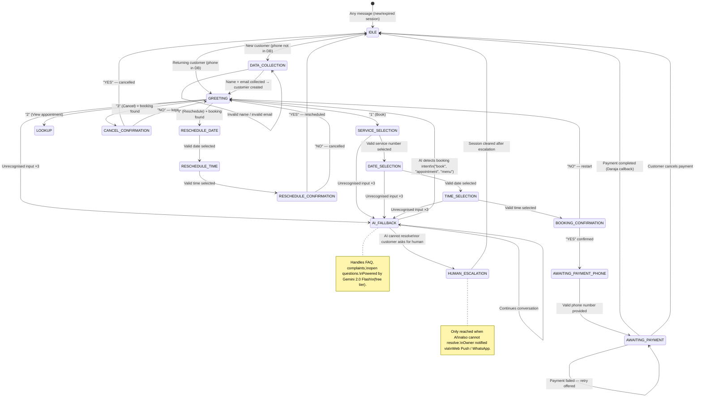

# WhatsApp Automation — Wanny's Nails

**Version:** 1.3

---

## Overview

The WhatsApp chatbot uses a **hybrid FSM + AI** architecture. A deterministic Finite State Machine handles all structured booking flows. A free-tier LLM (Gemini 2.0 Flash) handles edge cases the FSM cannot — FAQs, complaints, open questions, and ambiguous intent. Human escalation is the last resort, only when AI also cannot resolve.

## WhatsApp Cloud API integration flow

```
Facebook Account
   |
   |__Meta App
   |    |__Webhooks-------------------- Step 2
   |
   |__Business Portfolio
        |_Test WhatsApp Business     --- Step 1
        | account (WABA)
        |_Your WhatsApp Business account (WABA)
        |    |__Phone Number --------------- Step 2
        |    |__Message Templates ---------- Step 2
        |    |__Payment Method ------------- Step 2
        |
        |__System User --------------------- Step 2
        |__Business Verification ----------- Step 3
```

**Escalation ladder:**

```
FSM handles it          (structured flow — free, instant, deterministic)
       │
       │ unrecognised input ×3  OR  intent outside FSM scope
       ▼
AI_FALLBACK handles it  (FAQ, open questions — Gemini free tier)
       │
       │ AI cannot resolve  OR  customer explicitly asks for human
       ▼
HUMAN_ESCALATION        (owner notified via Web Push / WhatsApp)
```

**Why FSM first:**

- Deterministic: booking flows behave exactly the same every time
- Zero cost per message for the structured majority
- Easier to debug, test, and audit
- No hallucination risk on booking data (prices, times, availability)

**Why AI as fallback (not primary):**

- Handles the ~5% of messages outside the FSM scope
- Gemini 2.0 Flash free tier: 1,500 req/day — far exceeds expected fallback volume
- Constrained by a tight system prompt — cannot go off-script
- Detects booking intent and routes back to FSM automatically

---

## Conversation Architecture

```
Incoming WhatsApp message
         │
         ▼
POST /webhooks/whatsapp
         │
         ▼
Signature validation (X-Hub-Signature-256)
         │
         ▼
Message normalisation (extract phone, text/button reply/list reply)
         │
         ▼
Async queue (immediate 200 OK to WhatsApp)
         │
         ▼
Global intent check (STOP / human / menu keywords)
         │
         ▼
FSM Engine.process(phone, message)
         │
         ├── Load session from Redis (or create new)
         │
         ├── Lookup transition function for current state
         │
         ├── Execute transition (may read DB, create booking, etc.)
         │   │
         │   └── If state = AI_FALLBACK → call Gemini API
         │
         ├── Save updated session to Redis (TTL 30 min)
         │
         └── Send outbound messages via WhatsApp Cloud API
              (text, interactive lists, or interactive buttons)
```

---

## Interactive Messages

The bot uses WhatsApp interactive message types instead of plain text where appropriate. This gives customers a native, tap-to-select experience rather than typing numbers manually.

### Message Types Used

| WhatsApp Type           | Used For                                                                    | When                                           |
| ----------------------- | --------------------------------------------------------------------------- | ---------------------------------------------- |
| `interactive` (list)    | Main menu, service selection, date selection, time selection                | Multi-option menus with 3+ choices             |
| `interactive` (buttons) | Confirmations (booking, cancel, reschedule), payment retry/cancel           | Binary yes/no or 2-3 action choices            |
| `text`                  | Status messages, error messages, data collection (name/email, phone number) | Free-text input or informational-only messages |

### Interactive List Messages

Lists present a scrollable menu with a button trigger. When the customer taps the button, they see a sheet with sections and rows. Each row has:

- `id` — machine-readable identifier sent back to the FSM (e.g. `"1"`, `"2"`)
- `title` — short label visible in the list (max 24 chars)
- `description` — optional subtitle (max 72 chars)

### Interactive Button Messages

Buttons present 1-3 tappable buttons below a body message. Each button has:

- `id` — machine-readable identifier sent back to the FSM (e.g. `"yes"`, `"no"`)
- `title` — button label (max 20 chars, text only — no emoji)

### How Replies Are Parsed

When a customer taps a list row or button, WhatsApp sends an `interactive` webhook with `list_reply` or `button_reply`. The webhook controller extracts the `id` field and passes it as the message body to the FSM engine. This means the FSM receives the same values (`"1"`, `"yes"`, `"book"`, etc.) regardless of whether the customer typed the text or tapped an interactive element.

---

## Session Structure (Redis)

**Key:** `session:{e164Phone}` (e.g., `session:+254712345678`)
**TTL:** 1800 seconds (30 minutes, reset on each message)
**Format:** JSON

```typescript
interface ConversationSession {
  state: ConversationState;
  customerId?: string;
  customerName?: string;
  selectedService?: {
    id: string;
    name: string;
    durationMinutes: number;
    priceKes: number;
  };
  selectedDate?: string; // "2025-06-05" (EAT)
  selectedTime?: string; // "14:00" (EAT)
  appointmentAt?: string; // ISO UTC (computed after date+time selected)
  bookingId?: string;
  bookingRef?: string;
  paymentPhone?: string;
  invalidInputCount: number; // Increments on bad input; escalate at 3
  lastActivity: string; // ISO UTC
  flow?: "BOOKING" | "RESCHEDULE" | "CANCEL" | "LOOKUP";
  aiContext?: Array<{
    // Last 6 messages for Gemini conversation context
    role: "user" | "model";
    parts: [{ text: string }];
  }>;
}
```

---

## State Machine

### States

```typescript
type ConversationState =
  | "IDLE"
  | "GREETING"
  | "DATA_COLLECTION"
  | "SERVICE_SELECTION"
  | "DATE_SELECTION"
  | "TIME_SELECTION"
  | "BOOKING_CONFIRMATION"
  | "AWAITING_PAYMENT_PHONE"
  | "AWAITING_PAYMENT"
  | "RESCHEDULE_DATE"
  | "RESCHEDULE_TIME"
  | "RESCHEDULE_CONFIRMATION"
  | "CANCEL_CONFIRMATION"
  | "AI_FALLBACK"
  | "HUMAN_ESCALATION";
```

### State Transition Diagram



---

## State Handler Specifications

### State: IDLE / Session Expired

**Entry condition:** No existing session or TTL expired.

**Behaviour:**

- Check if customer exists in DB by phone number
- **Returning customer (phone in DB):** Load customer, transition to GREETING and send the interactive list menu
- **New customer (phone not in DB):** Do NOT create record yet — transition to DATA_COLLECTION to collect name & email

---

### State: DATA_COLLECTION

**Entry condition:** IDLE handler detected a new customer (phone not in DB). `session.collectionPhase` is set to `"NAME"`.

**Purpose:** Collect the new customer's name and optional email before creating their DB record and entering the main menu.

**Message type:** Plain text (free-text input required)

**Sub-phases:** Tracked via `session.collectionPhase`:

#### Phase: NAME

**Bot message (on entry):**

```
Hi! Welcome to Wanny's Nails! 👋

We'd love to get to know you better.
What's your name?
```

**Transitions:**

| Input                      | Transition                                                            |
| -------------------------- | --------------------------------------------------------------------- |
| Valid name (≥2 characters) | Save to `temporaryName`, set phase → EMAIL, ask for email             |
| Too short / empty          | "Please enter your full name (at least 2 characters)." — stay in NAME |

#### Phase: EMAIL

**Bot message:**

```
Nice to meet you, [Name]! 😊

Could you share your email address for your booking receipt? You can also type *skip* to continue without one.
```

**Transitions:**

| Input                                  | Transition                                                                                                              |
| -------------------------------------- | ----------------------------------------------------------------------------------------------------------------------- |
| Valid email                            | Create customer in DB (name + email), set `customerId` + `customerName` → GREETING                                      |
| "skip" / "no" / "nah" / "none" / "n/a" | Create customer in DB (name only, email=null) → GREETING                                                                |
| Invalid email format                   | "That doesn't look like a valid email address. Please enter a valid email, or type _skip_ to continue." — stay in EMAIL |

**On DB creation failure:** Log error, proceed to GREETING with the collected name as fallback.

---

### State: GREETING

**Message type:** 📋 Interactive List

**Bot message:**

```
Header:
Wanny's Nails 💅

Body:
Hi [name]! 👋 Welcome to Wanny's Nails.
How can we help you today?

Button:
Choose an option

Section: Appointments

┌──────────────────────────────────────────┐
│ Row 1: Book Appointment                  │
│         Schedule a new appointment       │
├──────────────────────────────────────────┤
│ Row 2: View Appointment                  │
│         Check your upcoming appointment  │
├──────────────────────────────────────────┤
│ Row 3: Reschedule                        │
│         Change your appointment date/time│
├──────────────────────────────────────────┤
│ Row 4: Cancel                            │
│         Cancel an existing appointment   │
└──────────────────────────────────────────┘
```

(If new/unknown customer, use "Hi there!")

**Transitions:**

| Input (list row id) | Transition                                    | Notes                                                              |
| ------------------- | --------------------------------------------- | ------------------------------------------------------------------ |
| `"1"`               | → SERVICE_SELECTION                           |                                                                    |
| `"2"`               | → LOOKUP (inline, no new state)               | Respond with booking details + action buttons                      |
| `"3"`               | → Check for active booking                    | If found → CANCEL_CONFIRMATION; if not → "No active booking found" |
| `"4"`               | → Check for active booking                    | If found → RESCHEDULE_DATE; if not → "No active booking"           |
| Anything else       | Stay in GREETING, increment invalidInputCount | Show menu again                                                    |

#### View Appointment Result

When the customer views an appointment, two messages are sent:

1. **Text message** showing the booking details
2. **Interactive button** with actions:

```
Body: What would you like to do?
Button: Manage booking

┌─────────────┐ ┌─────────────┐
│   Cancel    │ │  Reschedule │
└─────────────┘ └─────────────┘
```

| Button ID | Transition            |
| --------- | --------------------- |
| `"3"`     | → CANCEL_CONFIRMATION |
| `"4"`     | → RESCHEDULE_DATE     |

---

### State: SERVICE_SELECTION

**Message type:** 📋 Interactive List

**Bot message:**

```
Header:
Our Services

Body:
Which service would you like?

Button:
Choose a service

Section: Available Services

┌──────────────────────────────────────────┐
│ Gel Manicure                             │
│ KES 1,500 — 60 min                      │
├──────────────────────────────────────────┤
│ Acrylic Set                              │
│ KES 2,500 — 90 min                      │
├──────────────────────────────────────────┤
│ Nail Art                                 │
│ KES 2,000 — 75 min                      │
├──────────────────────────────────────────┤
│ Regular Manicure                         │
│ KES 800 — 45 min                        │
└──────────────────────────────────────────┘
```

Services are fetched from DB (only `isActive=true`, ordered by `sortOrder`).

**Transitions:**

| Input (list row id) | Transition                               |
| ------------------- | ---------------------------------------- |
| Valid number (1–N)  | Save service to session → DATE_SELECTION |
| Invalid             | Increment invalidInputCount, resend list |

---

### State: DATE_SELECTION

**Message type:** 📋 Interactive List

**Bot message:**

```
Header:
Pick a Date

Body:
When would you like your [Service Name]?

Button:
Choose a date

Section: Available Dates

┌──────────────────────────────────────────┐
│ Today (Thu 5 Jun)                        │
│ Available                                │
├──────────────────────────────────────────┤
│ Fri 6 Jun                                │
│ Available                                │
├──────────────────────────────────────────┤
│ Sat 7 Jun                                │
│ Available                                │
├──────────────────────────────────────────┤
│ Mon 9 Jun                                │
│ Available                                │
├──────────────────────────────────────────┤
│ Tue 10 Jun                               │
│ (Full — no description shown)            │
└──────────────────────────────────────────┘
```

Presents the next 7 business days. Fully booked days appear without a description (not selectable). Closed days are omitted.

**Slot count** is fetched from the availability engine. Available dates show "Available" in the description.

**Transitions:**

| Input (list row id)                | Transition                                         |
| ---------------------------------- | -------------------------------------------------- |
| Valid number for an available date | Save date to session → TIME_SELECTION              |
| Number for a full date             | "That day is fully booked. Please choose another." |
| Invalid                            | Increment invalidInputCount, resend list           |

---

### State: TIME_SELECTION

**Message type:** 📋 Interactive List

**Bot message:**

```
Header:
Pick a Time

Body:
Available times for [Service] on [Date]:

Button:
Choose a time

Section: Available Times

┌──────────────────────────────────────────┐
│ 10:00 AM                                 │
├──────────────────────────────────────────┤
│ 11:30 AM                                 │
├──────────────────────────────────────────┤
│ 2:00 PM                                  │
├──────────────────────────────────────────┤
│ 3:30 PM                                  │
└──────────────────────────────────────────┘
```

**Transitions:**

| Input (list row id) | Transition                                  |
| ------------------- | ------------------------------------------- |
| Valid number        | Save time to session → BOOKING_CONFIRMATION |
| Invalid             | Increment invalidInputCount, resend list    |

---

### State: BOOKING_CONFIRMATION

**Message type:** Text summary + 🔘 Interactive Buttons

**Bot messages:**

Message 1 (text):

```
Please confirm your booking:

✂️ Service: Gel Manicure
📅 Date: Thursday, 5 June 2025
⏰ Time: 2:00 PM
💰 Price: KES 1,500
```

Message 2 (interactive button):

```
Body: Does everything look good?
Button: Confirm booking

┌──────────────────┐ ┌──────────────────┐
│  Yes, Confirm    │ │ No, Start Over   │
└──────────────────┘ └──────────────────┘
```

**Transitions:**

| Input (button id)                           | Transition                                                |
| ------------------------------------------- | --------------------------------------------------------- |
| `"yes"` / `"YES"` / `"Yes"` / `"y"` / `"1"` | Create PENDING booking in DB → AWAITING_PAYMENT_PHONE     |
| `"no"` / `"NO"` / `"n"` / `"2"`             | Clear session context, "OK, let's start over." → GREETING |

---

### State: AWAITING_PAYMENT_PHONE

**Message type:** Text (free-text input for phone number)

**Bot message:**

```
Your booking has been received! 🎉
Reference: NB-2025-00123

To secure your slot, please pay KES 1,500 via M-Pesa.
What M-Pesa number should we send the payment request to?
(e.g., 0712 345 678)
```

**Transitions:**

| Input              | Transition                                                                     |
| ------------------ | ------------------------------------------------------------------------------ |
| Valid Kenyan phone | Save paymentPhone → enqueue STK Push → AWAITING_PAYMENT                        |
| Invalid            | "That doesn't look like a valid number. Please try again (e.g., 0712 345 678)" |

---

### State: AWAITING_PAYMENT

**Bot message (on entry):**

```
We've sent an M-Pesa payment request of KES 1,500 to 0712345678.
Please check your phone and enter your M-Pesa PIN to confirm. 📲

This request will expire in 5 minutes.
```

This state is **asynchronously exited** — the FSM does not block waiting. The Daraja callback triggers the next step via the payment callback processor.

**When payment succeeds (triggered by Daraja callback):**

```
Payment received! ✅

📋 Booking: NB-2025-00123
✂️ Service: Gel Manicure
📅 Thursday, 5 June 2025
⏰ 2:00 PM
📍 Wanny's Nails, Nairobi

We'll send you a reminder 24 hours before. See you then! 💅
```

Session cleared → IDLE

**When payment fails (triggered by Daraja callback):**

Message 1 (text):

```
The payment wasn't completed.
```

Message 2 (interactive button):

```
Body: What would you like to do?
Button: Choose an option

┌─────────────┐ ┌───────────────────┐
│  Try Again  │ │  Cancel Booking   │
└─────────────┘ └───────────────────┘
```

**If customer replies while in AWAITING_PAYMENT:**

- Button `"1"` or "retry" → enqueue new STK Push, stay in AWAITING_PAYMENT
- Button `"2"` or "cancel" → cancel the PENDING booking → IDLE

**On any other input while waiting:** Reminds the customer about the pending payment and shows the same action buttons.

---

### State: CANCEL_CONFIRMATION

**Message type:** Text summary + 🔘 Interactive Buttons

**Bot messages:**

Message 1 (text):

```
Are you sure you want to cancel your appointment?

✂️ Gel Manicure
📅 Thursday, 5 June at 2:00 PM
```

Message 2 (interactive button):

```
Body: Please confirm:
Button: Cancel appointment

┌────────────────┐ ┌────────────────┐
│  Yes, Cancel   │ │  No, Keep It   │
└────────────────┘ └────────────────┘
```

**Transitions:**

| Input (button id) | Transition                                              |
| ----------------- | ------------------------------------------------------- |
| `"1"` / `"yes"`   | Cancel booking in DB → send confirmation → IDLE         |
| `"2"` / `"no"`    | "Your appointment is still on! See you then. 💅" → IDLE |

---

### State: RESCHEDULE_DATE

**Message type:** 📋 Interactive List

Presents available dates for rescheduling, identical format to DATE_SELECTION but with the header "Pick a New Date" and button text "Choose a date".

---

### State: RESCHEDULE_TIME

**Message type:** 📋 Interactive List

Presents available times for the selected reschedule date, with header "Pick a New Time" and button text "Choose a time".

---

### State: RESCHEDULE_CONFIRMATION

**Message type:** Text summary + 🔘 Interactive Buttons

**Bot messages:**

Message 1 (text):

```
Please confirm your new appointment time:

✂️ Service: Gel Manicure
📅 Date: Thursday, 12 June 2025
⏰ Time: 3:00 PM
```

Message 2 (interactive button):

```
Body: Does everything look good?
Button: Confirm reschedule

┌────────────────────┐ ┌────────────────┐
│ Yes, Reschedule    │ │   No, Cancel   │
└────────────────────┘ └────────────────┘
```

**Transitions:**

| Input (button id)       | Transition                                                                     |
| ----------------------- | ------------------------------------------------------------------------------ |
| `"yes"` / `"y"` / `"1"` | Reschedule booking in DB → send confirmation → IDLE                            |
| `"no"` / `"n"` / `"2"`  | "Reschedule cancelled. Your original appointment remains unchanged. 💅" → IDLE |

---

### State: AI_FALLBACK

**Triggered by:**

- `invalidInputCount >= 3` in any FSM state
- Message received outside any active FSM flow (no current state / IDLE with unrecognised input)

**What AI handles:**

| Scenario                 | Example                                   |
| ------------------------ | ----------------------------------------- |
| FAQ                      | "Do you do eyelashes?"                    |
| Location / directions    | "Where exactly are you located?"          |
| Pricing questions        | "Is gel cheaper than acrylic?"            |
| Complaints               | "I wasn't happy with my last visit"       |
| Ambiguous booking intent | "I want something for my nails next week" |
| General chat             | "What are your busiest hours?"            |

**System prompt (sent with every Gemini request):**

```
You are a helpful assistant for Wanny's Nails salon in Nairobi, Kenya.

RULES:
- Answer questions about the salon only. Never discuss unrelated topics.
- Keep all replies under 3 sentences. Be warm and friendly.
- If the customer wants to book, cancel, or reschedule, reply with exactly:
  "To manage your appointment, please type MENU."
  Do not attempt to book on their behalf.
- If you cannot confidently answer, reply with exactly:
  "Let me connect you with our team — type HUMAN for personal assistance."
- Never invent prices, availability, or service details.

SALON INFO:
Name:     Wanny's Nails
Location: [Full address here]
Hours:    Monday–Saturday, 9 AM – 6 PM EAT
Phone:    +254 700 000 000
Services: Gel Manicure KES 1,500 (60 min)
          Acrylic Set KES 2,500 (90 min)
          Nail Art KES 2,000 (75 min)
          Regular Manicure KES 800 (45 min)
```

**Implementation:**

```typescript
async function handleAiFallback(
  session: ConversationSession,
  message: string,
): Promise<{ reply: string; nextState: ConversationState }> {
  // Keep last 6 messages as context (3 exchanges) — token efficient
  const history = session.aiContext?.slice(-6) ?? [];

  const response = await fetch(
    "https://generativelanguage.googleapis.com/v1beta/models/gemini-2.0-flash:generateContent?key=" +
      process.env.GEMINI_API_KEY,
    {
      method: "POST",
      headers: { "Content-Type": "application/json" },
      body: JSON.stringify({
        system_instruction: { parts: [{ text: SYSTEM_PROMPT }] },
        contents: [...history, { role: "user", parts: [{ text: message }] }],
        generationConfig: { maxOutputTokens: 150 }, // hard cap — keeps replies brief
      }),
    },
  );

  const data = await response.json();
  const reply = data.candidates[0].content.parts[0].text;

  // Detect handoff signals in AI reply
  const wantsHuman = /HUMAN|connect you with|our team/i.test(reply);
  const wantsMenu = /MENU|type menu/i.test(reply);

  // Append to context window (capped at 6 messages)
  session.aiContext = [
    ...history,
    { role: "user", parts: [{ text: message }] },
    { role: "model", parts: [{ text: reply }] },
  ].slice(-6);

  const nextState: ConversationState = wantsHuman
    ? "HUMAN_ESCALATION"
    : wantsMenu
      ? "GREETING"
      : "AI_FALLBACK";

  return { reply, nextState };
}
```

**Transitions:**

| Condition                                     | Next State                                   |
| --------------------------------------------- | -------------------------------------------- |
| AI reply contains "MENU"                      | → GREETING (customer re-enters booking flow) |
| AI reply contains "HUMAN" / escalation signal | → HUMAN_ESCALATION                           |
| Normal reply                                  | → AI_FALLBACK (continues conversation)       |
| Gemini API error / timeout                    | → HUMAN_ESCALATION (fail safe)               |

**Error handling:** If the Gemini API call fails for any reason (network error, rate limit, invalid response), fall through to `HUMAN_ESCALATION` immediately. Never leave the customer with no response.

**Cost:** Gemini 2.0 Flash free tier allows 1,500 requests/day. At ~200 conversations/day with an estimated 5–10% AI fallback rate, expected usage is 10–20 calls/day — well within the free tier.

---

### State: HUMAN_ESCALATION

**Triggered by:**

- Customer sends "human", "agent", "help me", or "talk to someone" from any state
- AI_FALLBACK handler determines it cannot resolve the customer's issue
- AI reply contains escalation signal (see AI_FALLBACK spec below)

Note: `invalidInputCount >= 3` now triggers `AI_FALLBACK`, not `HUMAN_ESCALATION` directly.

**Bot message:**

```
I'm going to connect you with our team right away.
Please wait a moment — someone will be with you shortly.

You can also call us on +254 700 000 000.
```

**System action:**

1. Enqueue a notification job that sends a **Web Push notification** to the owner's installed PWA
2. If Web Push permission not granted or PWA not installed: fall back to a WhatsApp message to the owner's personal number
3. Notification payload:

```json
{
  "title": "Customer needs help — Wanny's Nails",
  "body": "{{customerName}} ({{phone}}) needs assistance.",
  "data": {
    "url": "/customers/{{customerId}}",
    "customerPhone": "{{phone}}",
    "conversationSummary": "{{lastFewMessages}}"
  }
}
```

4. Clicking the notification opens the PWA directly to the customer's profile
5. Session cleared → IDLE. Owner responds via their personal WhatsApp directly to the customer.

---

## Interactive Message Summary by State

| State                          | Message Type        | Details                                              |
| ------------------------------ | ------------------- | ---------------------------------------------------- |
| **IDLE → GREETING**            | 📋 Interactive list | Main menu with 4 options                             |
| **DATA_COLLECTION**            | Text                | Free-text input for name and email                   |
| **GREETING** (menu)            | 📋 Interactive list | Main menu re-displayed on invalid input              |
| **GREETING** (view)            | Text + 🔘 Buttons   | Booking details text, then Cancel/Reschedule buttons |
| **SERVICE_SELECTION**          | 📋 Interactive list | Service options with price and duration              |
| **DATE_SELECTION**             | 📋 Interactive list | Available dates with slot info                       |
| **TIME_SELECTION**             | 📋 Interactive list | Available time slots                                 |
| **BOOKING_CONFIRMATION**       | Text + 🔘 Buttons   | Summary text, then Yes, Confirm / No, Start Over     |
| **AWAITING_PAYMENT_PHONE**     | Text                | Free-text input for phone number                     |
| **AWAITING_PAYMENT**           | Text + 🔘 Buttons   | Payment status, then Resend Request / Cancel Booking |
| **CANCEL_CONFIRMATION**        | Text + 🔘 Buttons   | Summary text, then Yes, Cancel / No, Keep It         |
| **RESCHEDULE_DATE**            | 📋 Interactive list | Available dates for rescheduling                     |
| **RESCHEDULE_TIME**            | 📋 Interactive list | Available times for rescheduling                     |
| **RESCHEDULE_CONFIRMATION**    | Text + 🔘 Buttons   | Summary text, then Yes, Reschedule / No, Cancel      |
| **AI_FALLBACK**                | Text                | AI-generated responses                               |
| **HUMAN_ESCALATION**           | Text                | Escalation notice                                    |
| **Payment callback (success)** | Text                | Confirmation details                                 |
| **Payment callback (fail)**    | Text + 🔘 Buttons   | Error text, then Try Again / Cancel Booking          |

---

## Timeout Handling

Redis TTL automatically expires sessions after 30 minutes of inactivity. When an expired customer sends a new message, the system detects the absence of a session and starts fresh.

**On session expiry + new message:**

```
Your previous session expired due to inactivity.
Let's start fresh! 😊

[Sends GREETING interactive list menu]
```

---

## Invalid Input Handling

Every state increments `invalidInputCount` on an unrecognised input.

- Counts 1–2: Resend the interactive menu/options with the appropriate message type
- Count 3: Transition to `AI_FALLBACK` — the AI attempts to understand what the customer needs and either answers, routes back to the menu, or escalates to human.

The counter resets to 0 on any successful state transition.

---

## Global Intent Detection

Before processing a message with the current state's handler, the FSM checks for global intents that override the current flow:

| Keyword                                        | Action                                                                   |
| ---------------------------------------------- | ------------------------------------------------------------------------ |
| "stop", "STOP", "unsubscribe"                  | Opt out of all messaging. Log consent withdrawal. Send farewell message. |
| "human", "agent", "help me", "talk to someone" | → HUMAN_ESCALATION (skip AI — customer explicitly wants a person)        |
| "menu", "start" (in non-IDLE states)           | → GREETING (restart flow — sends interactive list)                       |
| Unrecognised in any FSM state ×3               | → AI_FALLBACK                                                            |

Note: Global intent keywords also work when the customer types them instead of tapping interactive elements, providing a text-based escape hatch at any point.

---

## WhatsApp Message Templates

Templates must be approved by Meta before use. Used for outbound messages outside the 24-hour conversation window.

### Template: `appointment_reminder_24h`

```
Hello {{1}}! 👋

This is a reminder about your appointment tomorrow:

✂️ {{2}}
📅 {{3}}
⏰ {{4}}
📍 Wanny's Nails, Nairobi

Reply "reschedule" or "cancel" if your plans change.
See you soon! 💅
```

Variables: `[customerName, serviceName, date, time]`

### Template: `appointment_reminder_1h`

```
Hi {{1}}! Your appointment is in 1 hour.

✂️ {{2}} at {{3}}
📍 Wanny's Nails, Nairobi

See you soon! 💅
```

### Template: `booking_confirmed`

```
Your appointment has been confirmed! ✅

📋 Ref: {{1}}
✂️ {{2}}
📅 {{3}} at {{4}}
📍 Wanny's Nails, Nairobi

See you then! 💅
```

### Template: `booking_cancelled`

```
Your appointment has been cancelled.

✂️ {{1}} on {{2}}

We hope to see you again soon. Book a new appointment anytime by messaging us here.
```

---

## Interactive Message Payload Types

The `OutboundMessage` type in `types.ts` supports three message formats:

```typescript
interface OutboundMessage {
  type: "text" | "interactive_list" | "interactive_button";

  // For "text" messages
  text?: string;

  // For "interactive_list" messages
  listTitle?: string; // Header text (max 60 chars)
  listButtonText?: string; // Trigger button label (max 20 chars)
  listSections?: Array<{
    title?: string; // Section heading
    rows: Array<{
      id: string; // Machine-readable ID sent back on tap
      title: string; // Row label (max 24 chars)
      description?: string; // Optional subtitle (max 72 chars)
    }>;
  }>;

  // For "interactive_button" messages
  buttonTitle?: string; // Hidden field for button group metadata
  buttons?: Array<{
    id: string; // Machine-readable ID sent back on tap
    title: string; // Button label (max 20 chars, text only)
  }>;
}
```

---

## AI Fallback Configuration

```bash
# Required environment variable
GEMINI_API_KEY=your_gemini_api_key   # from aistudio.google.com — free, no card required
```

The AI fallback is **opt-in via environment variable**. If `GEMINI_API_KEY` is not set, `invalidInputCount >= 3` falls through directly to `HUMAN_ESCALATION` — preserving backward compatibility with the original FSM-only behaviour.

WhatsApp Cloud API has per-phone rate limits. The notification queue processor respects these:

- Max 1 message per second per recipient
- Queue processor uses a per-phone token bucket (Redis-based)
- If rate limited: message is re-enqueued with a 2-second delay

---

## Webhook Delivery Reliability

WhatsApp Cloud API guarantees at-least-once delivery. The FSM is designed to be idempotent:

- Message IDs (`wamid`) are stored in Redis with a 5-minute TTL
- If a message with the same `wamid` is received twice, the second is discarded
- This prevents duplicate state transitions from WhatsApp retries
