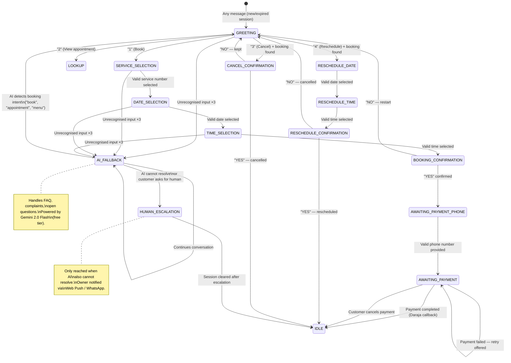

# WhatsApp Automation — Wanny's Nails

**Version:** 1.2

---

## Overview

The WhatsApp chatbot uses a **hybrid FSM + AI** architecture. A deterministic Finite State Machine handles all structured booking flows. A free-tier LLM (Gemini 2.0 Flash) handles edge cases the FSM cannot — FAQs, complaints, open questions, and ambiguous intent. Human escalation is the last resort, only when AI also cannot resolve.

**Escalation ladder:**
```
FSM handles it          (structured flow — free, instant, deterministic)
       │
       │ unrecognised input ×3  OR  intent outside FSM scope
       ▼
AI_FALLBACK handles it  (FAQ, open questions — Gemini free tier)
       │
       │ AI cannot resolve  OR  customer explicitly asks for human
       ▼
HUMAN_ESCALATION        (owner notified via Web Push / WhatsApp)
```

**Why FSM first:**
- Deterministic: booking flows behave exactly the same every time
- Zero cost per message for the structured majority
- Easier to debug, test, and audit
- No hallucination risk on booking data (prices, times, availability)

**Why AI as fallback (not primary):**
- Handles the ~5% of messages outside the FSM scope
- Gemini 2.0 Flash free tier: 1,500 req/day — far exceeds expected fallback volume
- Constrained by a tight system prompt — cannot go off-script
- Detects booking intent and routes back to FSM automatically

---

## Conversation Architecture

```
Incoming WhatsApp message
         │
         ▼
POST /webhooks/whatsapp
         │
         ▼
Signature validation (X-Hub-Signature-256)
         │
         ▼
Message normalisation (extract phone, text/button reply)
         │
         ▼
Async queue (immediate 200 OK to WhatsApp)
         │
         ▼
Global intent check (STOP / human / menu keywords)
         │
         ▼
FSM Engine.process(phone, message)
         │
         ├── Load session from Redis (or create new)
         │
         ├── Lookup transition function for current state
         │
         ├── Execute transition (may read DB, create booking, etc.)
         │   │
         │   └── If state = AI_FALLBACK → call Gemini API
         │
         ├── Save updated session to Redis (TTL 30 min)
         │
         └── Send outbound messages via WhatsApp Cloud API
```

---

## Session Structure (Redis)

**Key:** `session:{e164Phone}` (e.g., `session:+254712345678`)
**TTL:** 1800 seconds (30 minutes, reset on each message)
**Format:** JSON

```typescript
interface ConversationSession {
  state: ConversationState;
  customerId?: string;
  customerName?: string;
  selectedService?: {
    id: string;
    name: string;
    durationMinutes: number;
    priceKes: number;
  };
  selectedDate?: string;       // "2025-06-05" (EAT)
  selectedTime?: string;       // "14:00" (EAT)
  appointmentAt?: string;      // ISO UTC (computed after date+time selected)
  bookingId?: string;
  bookingRef?: string;
  paymentPhone?: string;
  invalidInputCount: number;   // Increments on bad input; escalate at 3
  lastActivity: string;        // ISO UTC
  flow?: 'BOOKING' | 'RESCHEDULE' | 'CANCEL' | 'LOOKUP';
  aiContext?: Array<{          // Last 6 messages for Gemini conversation context
    role: 'user' | 'model';
    parts: [{ text: string }];
  }>;
}
```

---

## State Machine

### States

```typescript
type ConversationState =
  | 'IDLE'
  | 'GREETING'
  | 'SERVICE_SELECTION'
  | 'DATE_SELECTION'
  | 'TIME_SELECTION'
  | 'BOOKING_CONFIRMATION'
  | 'AWAITING_PAYMENT_PHONE'
  | 'AWAITING_PAYMENT'
  | 'RESCHEDULE_DATE'
  | 'RESCHEDULE_TIME'
  | 'RESCHEDULE_CONFIRMATION'
  | 'CANCEL_CONFIRMATION'
  | 'AI_FALLBACK'
  | 'HUMAN_ESCALATION';
```

### State Transition Diagram



---

## State Handler Specifications

### State: IDLE / Session Expired

**Entry condition:** No existing session or TTL expired.

**Behaviour:**
- Create a new customer record if phone number is not in DB (or load existing)
- Check if customer has a prior incomplete session (same session in DB)
- Transition to GREETING

---

### State: GREETING

**Bot message:**
```
Hi [name]! 👋 Welcome to Wanny's Nails.
What would you like to do?

1. Book an appointment
2. View my upcoming appointment
3. Cancel my appointment
4. Reschedule my appointment

Reply with a number.
```

(If new/unknown customer, use "Hi there!")

**Transitions:**

| Input | Transition | Notes |
|---|---|---|
| "1" or "book" | → SERVICE_SELECTION | |
| "2" or "view" | → LOOKUP (inline, no new state) | Respond with booking details |
| "3" or "cancel" | → Check for active booking | If found → CANCEL_CONFIRMATION; if not → "No active booking found" |
| "4" or "reschedule" | → Check for active booking | If found → RESCHEDULE_DATE; if not → "No active booking" |
| Anything else | Stay in GREETING, increment invalidInputCount | Show menu again |

---

### State: SERVICE_SELECTION

**Bot message:**
```
Which service would you like?

1. Gel Manicure — KES 1,500 (60 min)
2. Acrylic Set — KES 2,500 (90 min)
3. Nail Art — KES 2,000 (75 min)
4. Regular Manicure — KES 800 (45 min)

Reply with a number.
```

Services are fetched from DB (only `isActive=true`, ordered by `sortOrder`).

**Transitions:**

| Input | Transition |
|---|---|
| Valid number (1–N) | Save service to session → DATE_SELECTION |
| Invalid | Increment invalidInputCount, resend menu |

---

### State: DATE_SELECTION

**Bot message:**
```
When would you like your [Service Name]?

1. Today (Thu 5 Jun) — 3 slots available
2. Fri 6 Jun — 5 slots available
3. Sat 7 Jun — 4 slots available
4. Mon 9 Jun — 6 slots available
5. Tue 10 Jun — Full

Reply with a number.
```

Presents the next 7 days. Fully booked days shown as "Full" (not selectable). Closed days omitted.

**Slot count** is fetched from the availability engine to show context.

**Transitions:**

| Input | Transition |
|---|---|
| Valid number for an available date | Save date to session → TIME_SELECTION |
| Number for a full date | "That day is fully booked. Please choose another." |
| Invalid | Increment invalidInputCount, resend menu |

---

### State: TIME_SELECTION

**Bot message:**
```
Available times for [Service] on [Date]:

1. 10:00 AM
2. 11:30 AM
3. 2:00 PM
4. 3:30 PM

Reply with a number.
```

**Transitions:**

| Input | Transition |
|---|---|
| Valid number | Save time to session → BOOKING_CONFIRMATION |
| Invalid | Increment invalidInputCount, resend list |

---

### State: BOOKING_CONFIRMATION

**Bot message:**
```
Please confirm your booking:

✂️ Service: Gel Manicure
📅 Date: Thursday, 5 June 2025
⏰ Time: 2:00 PM
💰 Price: KES 1,500

Reply YES to confirm or NO to start over.
```

**Transitions:**

| Input | Transition |
|---|---|
| "yes", "YES", "Yes", "y", "1" | Create PENDING booking in DB → AWAITING_PAYMENT_PHONE |
| "no", "NO", "n", "2" | Clear session context, "OK, let's start over." → GREETING |

---

### State: AWAITING_PAYMENT_PHONE

**Bot message:**
```
Your booking has been received! 🎉
Reference: NB-2025-00123

To secure your slot, please pay KES 1,500 via M-Pesa.
What M-Pesa number should we send the payment request to?
(e.g., 0712 345 678)
```

**Transitions:**

| Input | Transition |
|---|---|
| Valid Kenyan phone | Save paymentPhone → enqueue STK Push → AWAITING_PAYMENT |
| Invalid | "That doesn't look like a valid number. Please try again (e.g., 0712 345 678)" |

---

### State: AWAITING_PAYMENT

**Bot message (on entry):**
```
We've sent an M-Pesa payment request of KES 1,500 to 0712345678.
Please check your phone and enter your M-Pesa PIN to confirm. 📲

This request will expire in 5 minutes.
```

This state is **asynchronously exited** — the FSM does not block waiting. The Daraja callback triggers the next step via the payment callback processor.

**When payment succeeds (triggered by Daraja callback):**
```
Payment received! ✅

📋 Booking: NB-2025-00123
✂️ Service: Gel Manicure
📅 Thursday, 5 June 2025
⏰ 2:00 PM
📍 Wanny's Nails, Nairobi

We'll send you a reminder 24 hours before. See you then! 💅
```
Session cleared → IDLE

**When payment fails (triggered by Daraja callback):**
```
The payment wasn't completed.

1. Try again
2. Cancel booking

Reply with a number.
```

**If customer replies while in AWAITING_PAYMENT:**
- "1" or "retry" → enqueue new STK Push, stay in AWAITING_PAYMENT
- "2" or "cancel" → cancel the PENDING booking → IDLE

---

### State: CANCEL_CONFIRMATION

**Bot message:**
```
Are you sure you want to cancel your appointment?

✂️ Gel Manicure
📅 Thursday, 5 June at 2:00 PM

1. Yes, cancel it
2. No, keep my appointment
```

**Transitions:**

| Input | Transition |
|---|---|
| "1" or "yes" | Cancel booking in DB → send confirmation → IDLE |
| "2" or "no" | "Your appointment is still on! See you then. 💅" → IDLE |

---

### State: AI_FALLBACK

**Triggered by:**
- `invalidInputCount >= 3` in any FSM state
- Message received outside any active FSM flow (no current state / IDLE with unrecognised input)

**What AI handles:**

| Scenario | Example |
|---|---|
| FAQ | "Do you do eyelashes?" |
| Location / directions | "Where exactly are you located?" |
| Pricing questions | "Is gel cheaper than acrylic?" |
| Complaints | "I wasn't happy with my last visit" |
| Ambiguous booking intent | "I want something for my nails next week" |
| General chat | "What are your busiest hours?" |

**System prompt (sent with every Gemini request):**

```
You are a helpful assistant for Wanny's Nails salon in Nairobi, Kenya.

RULES:
- Answer questions about the salon only. Never discuss unrelated topics.
- Keep all replies under 3 sentences. Be warm and friendly.
- If the customer wants to book, cancel, or reschedule, reply with exactly:
  "To manage your appointment, please type MENU."
  Do not attempt to book on their behalf.
- If you cannot confidently answer, reply with exactly:
  "Let me connect you with our team — type HUMAN for personal assistance."
- Never invent prices, availability, or service details.

SALON INFO:
Name:     Wanny's Nails
Location: [Full address here]
Hours:    Monday–Saturday, 9 AM – 6 PM EAT
Phone:    +254 700 000 000
Services: Gel Manicure KES 1,500 (60 min)
          Acrylic Set KES 2,500 (90 min)
          Nail Art KES 2,000 (75 min)
          Regular Manicure KES 800 (45 min)
```

**Implementation:**

```typescript
async function handleAiFallback(
  session: ConversationSession,
  message: string
): Promise<{ reply: string; nextState: ConversationState }> {

  // Keep last 6 messages as context (3 exchanges) — token efficient
  const history = session.aiContext?.slice(-6) ?? [];

  const response = await fetch(
    'https://generativelanguage.googleapis.com/v1beta/models/gemini-2.0-flash:generateContent?key='
    + process.env.GEMINI_API_KEY,
    {
      method: 'POST',
      headers: { 'Content-Type': 'application/json' },
      body: JSON.stringify({
        system_instruction: { parts: [{ text: SYSTEM_PROMPT }] },
        contents: [
          ...history,
          { role: 'user', parts: [{ text: message }] }
        ],
        generationConfig: { maxOutputTokens: 150 }  // hard cap — keeps replies brief
      })
    }
  );

  const data = await response.json();
  const reply = data.candidates[0].content.parts[0].text;

  // Detect handoff signals in AI reply
  const wantsHuman = /HUMAN|connect you with|our team/i.test(reply);
  const wantsMenu  = /MENU|type menu/i.test(reply);

  // Append to context window (capped at 6 messages)
  session.aiContext = [
    ...history,
    { role: 'user',  parts: [{ text: message }] },
    { role: 'model', parts: [{ text: reply }] },
  ].slice(-6);

  const nextState: ConversationState = wantsHuman
    ? 'HUMAN_ESCALATION'
    : wantsMenu
    ? 'GREETING'
    : 'AI_FALLBACK';

  return { reply, nextState };
}
```

**Transitions:**

| Condition | Next State |
|---|---|
| AI reply contains "MENU" | → GREETING (customer re-enters booking flow) |
| AI reply contains "HUMAN" / escalation signal | → HUMAN_ESCALATION |
| Normal reply | → AI_FALLBACK (continues conversation) |
| Gemini API error / timeout | → HUMAN_ESCALATION (fail safe) |

**Error handling:** If the Gemini API call fails for any reason (network error, rate limit, invalid response), fall through to `HUMAN_ESCALATION` immediately. Never leave the customer with no response.

**Cost:** Gemini 2.0 Flash free tier allows 1,500 requests/day. At ~200 conversations/day with an estimated 5–10% AI fallback rate, expected usage is 10–20 calls/day — well within the free tier.

---

### State: HUMAN_ESCALATION

**Triggered by:**
- Customer sends "human", "agent", "help me", or "talk to someone" from any state
- AI_FALLBACK handler determines it cannot resolve the customer's issue
- AI reply contains escalation signal (see AI_FALLBACK spec below)

Note: `invalidInputCount >= 3` now triggers `AI_FALLBACK`, not `HUMAN_ESCALATION` directly.

**Bot message:**
```
I'm going to connect you with our team right away.
Please wait a moment — someone will be with you shortly.

You can also call us on +254 700 000 000.
```

**System action:**
1. Enqueue a notification job that sends a **Web Push notification** to the owner's installed PWA
2. If Web Push permission not granted or PWA not installed: fall back to a WhatsApp message to the owner's personal number
3. Notification payload:

```json
{
  "title": "Customer needs help — Wanny's Nails",
  "body": "{{customerName}} ({{phone}}) needs assistance.",
  "data": {
    "url": "/customers/{{customerId}}",
    "customerPhone": "{{phone}}",
    "conversationSummary": "{{lastFewMessages}}"
  }
}
```

4. Clicking the notification opens the PWA directly to the customer's profile
5. Session cleared → IDLE. Owner responds via their personal WhatsApp directly to the customer.

---

## Timeout Handling

Redis TTL automatically expires sessions after 30 minutes of inactivity. When an expired customer sends a new message, the system detects the absence of a session and starts fresh.

**On session expiry + new message:**
```
Your previous session expired due to inactivity.
Let's start fresh! 😊

[Sends GREETING menu]
```

---

## Invalid Input Handling

Every state increments `invalidInputCount` on an unrecognised input.

- Counts 1–2: Resend the menu/options with: "Sorry, I didn't understand that. Please reply with a number from the list."
- Count 3: Transition to `AI_FALLBACK` — the AI attempts to understand what the customer needs and either answers, routes back to the menu, or escalates to human.

The counter resets to 0 on any successful state transition.

---

## Global Intent Detection

Before processing a message with the current state's handler, the FSM checks for global intents that override the current flow:

| Keyword | Action |
|---|---|
| "stop", "STOP", "unsubscribe" | Opt out of all messaging. Log consent withdrawal. Send farewell message. |
| "human", "agent", "help me", "talk to someone" | → HUMAN_ESCALATION (skip AI — customer explicitly wants a person) |
| "menu", "start" (in non-IDLE states) | → GREETING (restart flow) |
| Unrecognised in any FSM state ×3 | → AI_FALLBACK |

---

## WhatsApp Message Templates

Templates must be approved by Meta before use. Used for outbound messages outside the 24-hour conversation window.

### Template: `appointment_reminder_24h`

```
Hello {{1}}! 👋

This is a reminder about your appointment tomorrow:

✂️ {{2}}
📅 {{3}}
⏰ {{4}}
📍 Wanny's Nails, Nairobi

Reply "reschedule" or "cancel" if your plans change.
See you soon! 💅
```

Variables: `[customerName, serviceName, date, time]`

### Template: `appointment_reminder_1h`

```
Hi {{1}}! Your appointment is in 1 hour.

✂️ {{2}} at {{3}}
📍 Wanny's Nails, Nairobi

See you soon! 💅
```

### Template: `booking_confirmed`

```
Your appointment has been confirmed! ✅

📋 Ref: {{1}}
✂️ {{2}}
📅 {{3}} at {{4}}
📍 Wanny's Nails, Nairobi

See you then! 💅
```

### Template: `booking_cancelled`

```
Your appointment has been cancelled.

✂️ {{1}} on {{2}}

We hope to see you again soon. Book a new appointment anytime by messaging us here.
```

---

## AI Fallback Configuration

```bash
# Required environment variable
GEMINI_API_KEY=your_gemini_api_key   # from aistudio.google.com — free, no card required
```

The AI fallback is **opt-in via environment variable**. If `GEMINI_API_KEY` is not set, `invalidInputCount >= 3` falls through directly to `HUMAN_ESCALATION` — preserving backward compatibility with the original FSM-only behaviour.

WhatsApp Cloud API has per-phone rate limits. The notification queue processor respects these:

- Max 1 message per second per recipient
- Queue processor uses a per-phone token bucket (Redis-based)
- If rate limited: message is re-enqueued with a 2-second delay

---

## Webhook Delivery Reliability

WhatsApp Cloud API guarantees at-least-once delivery. The FSM is designed to be idempotent:

- Message IDs (`wamid`) are stored in Redis with a 5-minute TTL
- If a message with the same `wamid` is received twice, the second is discarded
- This prevents duplicate state transitions from WhatsApp retries
